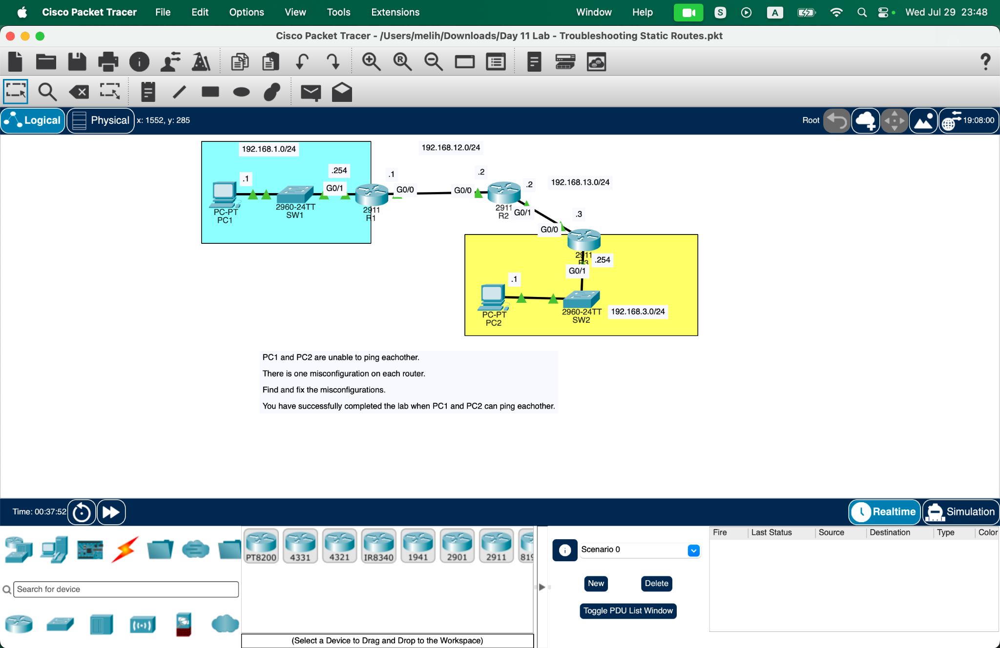
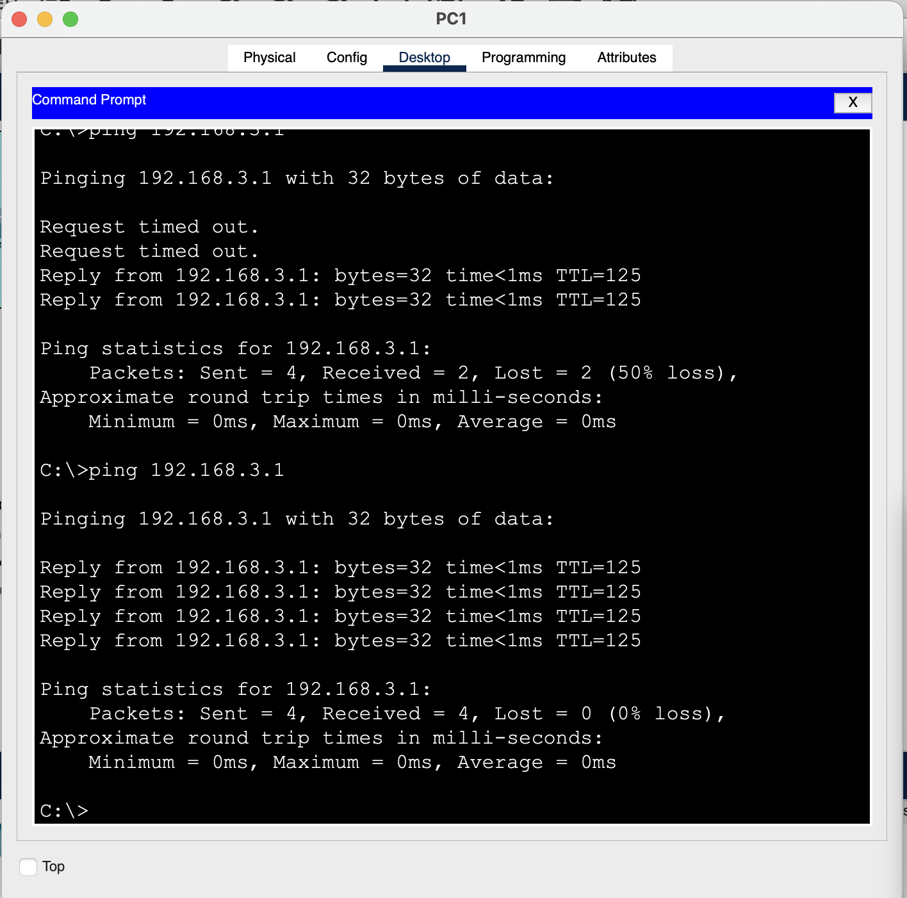
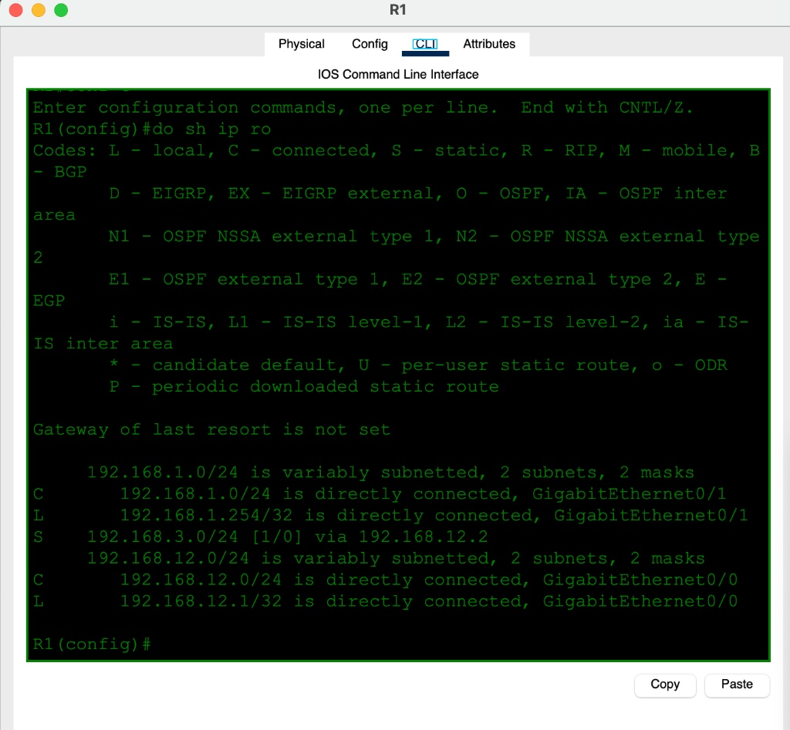
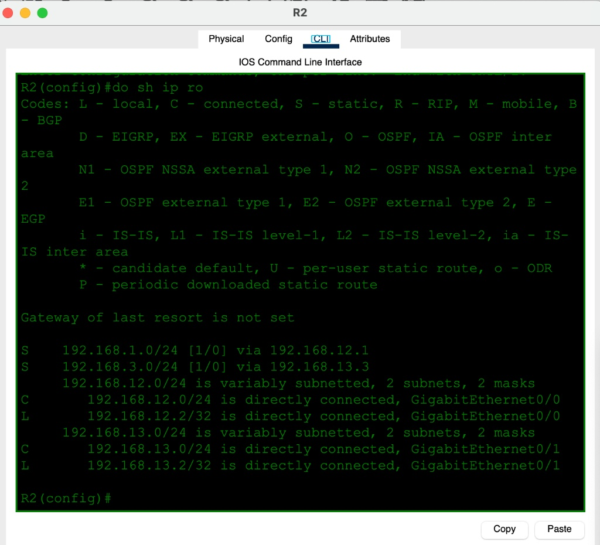
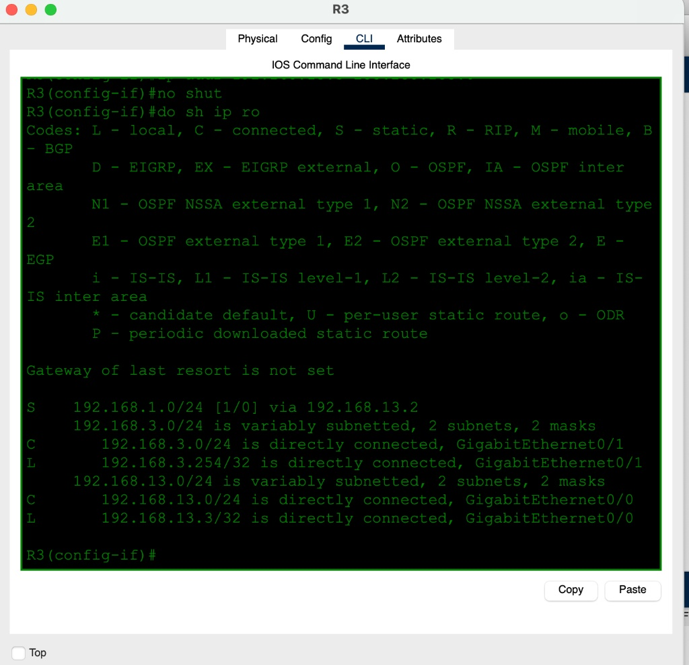

# Day 11.2 — Troubleshooting Static Routes (Part 2)

**Topic:** Troubleshooting static-route misconfigurations
**Simulator:** Cisco Packet Tracer — `Day 11 Lab - Troubleshooting Static Routes.pkt`
**Course reference:** Jeremy's IT Lab — CCNA 200-301, Day 11 (Static Routing)

---

## 🎯 Objective

This is **Part 2** of the static-routing lab. PC1 and PC2 initially cannot communicate because there is **one routing misconfiguration on each router**. Use the topology and `show ip route` to identify the errors, correct them, and verify end-to-end connectivity.

## 🗺️ Topology

PC1 (`192.168.1.1/24`) reaches PC2 (`192.168.3.1/24`) through R1 → R2 → R3. The transit links are `192.168.12.0/24` between R1/R2 and `192.168.13.0/24` between R2/R3.



| Router | Correct remote routes after troubleshooting |
|---|---|
| R1 | `192.168.3.0/24` via `192.168.12.2` |
| R2 | `192.168.1.0/24` via `192.168.12.1`; `192.168.3.0/24` via `192.168.13.3` |
| R3 | `192.168.1.0/24` via `192.168.13.2` |

## 🛠️ Troubleshooting process

### 1 — Establish the failure

Start at PC1 and ping PC2:
```
ping 192.168.3.1
```

The initial test fails because the static routes are not correct. After fixing the routers, run the test again; all four replies should succeed.



> The first successful ping after a routing change may drop one or two packets while ARP resolves MAC addresses. Repeating it gives the reliable `0% loss` result shown here.

### 2 — Inspect each routing table

On every router, use:
```
show ip route
```

Compare every route marked **S** with the topology. A static route must point to the next-hop IP address on the directly connected transit network.







### 3 — Correct the routes

Remove the incorrect static route on each router with `no ip route ...`, then add the correct route:

```
! R1
ip route 192.168.3.0 255.255.255.0 192.168.12.2

! R2
ip route 192.168.1.0 255.255.255.0 192.168.12.1
ip route 192.168.3.0 255.255.255.0 192.168.13.3

! R3
ip route 192.168.1.0 255.255.255.0 192.168.13.2
```

## ✅ Verification

| Check | Expected result |
|---|---|
| R1 `show ip route` | `S 192.168.3.0/24 via 192.168.12.2` |
| R2 `show ip route` | Static routes to both remote LANs |
| R3 `show ip route` | `S 192.168.1.0/24 via 192.168.13.2` |
| PC1 `ping 192.168.3.1` | 4 replies, 0% loss on the repeated test |

## 💡 What I learned

Troubleshooting static routing is mostly about checking the routing table against the topology, one router at a time. The destination network and mask must be correct, but the next-hop address matters just as much: it must be the IP address of the adjacent router on the connected transit link. I also learned not to treat the first ping loss after a change as a routing failure, because ARP resolution can cause a short delay.

## 📎 Files in this lab

- `README.md` — this writeup
- `day11-troubleshooting-static-routes.pkt` — Packet Tracer save _(add your file)_
- `day11-part2-topology.svg` and four verification screenshots
