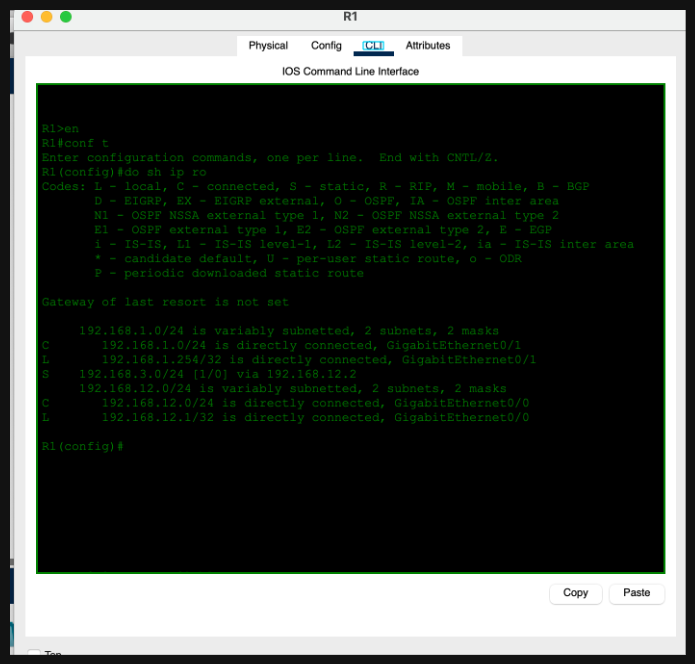
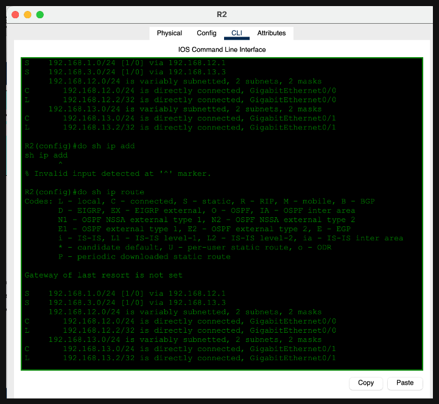
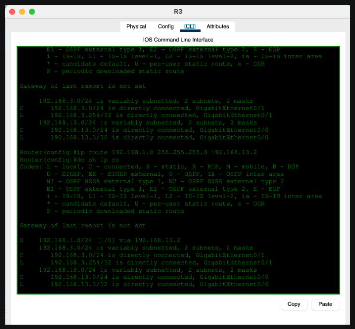
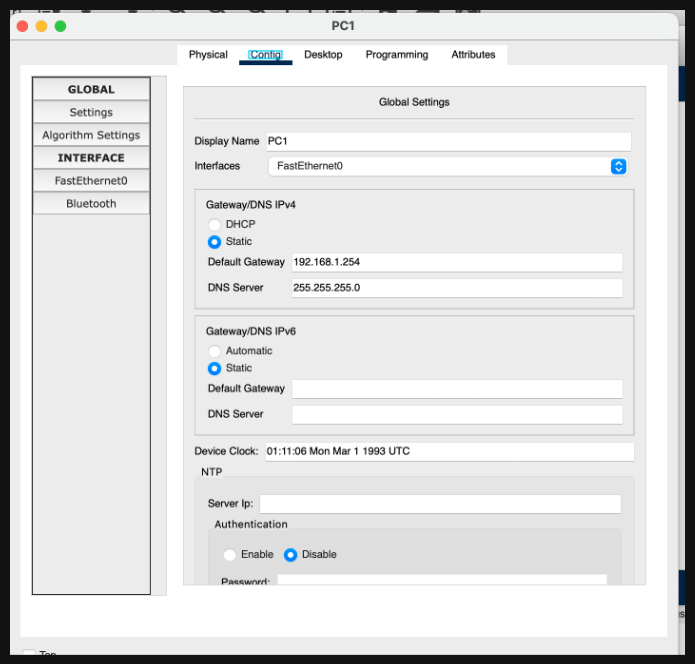
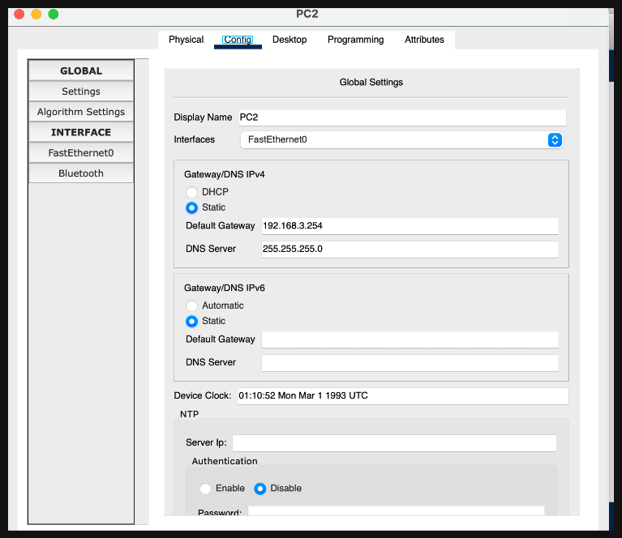
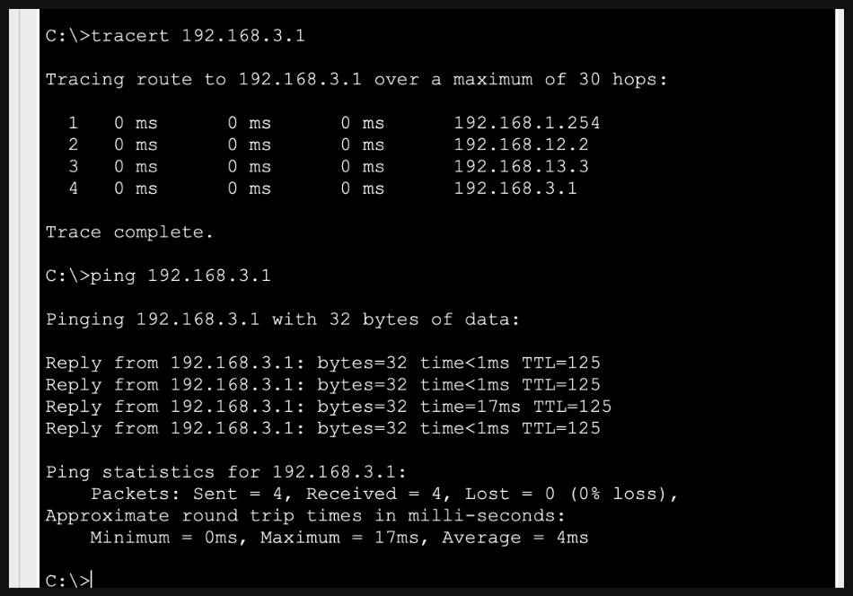

# Day 11 — Static Routing (Part 1)

**Topic:** Static routes between three routed networks
**Simulator:** Cisco Packet Tracer — `Day 11 Lab - Static Routing Part 1.pkt`
**Course reference:** Jeremy's IT Lab — CCNA 200-301, Day 11 (Static Routing)

---

## 🎯 Objective

> **Part 1:** Build reachability between the `192.168.1.0/24` and `192.168.3.0/24` LANs through two transit links. Configure static routes on R1, R2, and R3, then verify the full path from PC1 to PC2 with both `tracert` and `ping`.

## 🗺️ Topology & addressing

| Device | Interface / endpoint | Address | Purpose |
|---|---|---:|---|
| PC1 | FastEthernet0 | `192.168.1.1/24` | Host on LAN 1 |
| PC1 | Default gateway | `192.168.1.254` | R1 |
| R1 | G0/1 | `192.168.1.254/24` | LAN 1 gateway |
| R1 | G0/0 | `192.168.12.1/24` | Transit link to R2 |
| R2 | G0/0 | `192.168.12.2/24` | Transit link to R1 |
| R2 | G0/1 | `192.168.13.2/24` | Transit link to R3 |
| R3 | G0/0 | `192.168.13.3/24` | Transit link to R2 |
| R3 | G0/1 | `192.168.3.254/24` | LAN 3 gateway |
| PC2 | FastEthernet0 | `192.168.3.1/24` | Host on LAN 3 |
| PC2 | Default gateway | `192.168.3.254` | R3 |

## 🛠️ Configuration

### 1 — Configure the static routes

After assigning the interface addresses and enabling the interfaces, add routes for every remote LAN.

**R1 — route to LAN 3 through R2**
```
ip route 192.168.3.0 255.255.255.0 192.168.12.2
```

**R2 — routes to both edge LANs**
```
ip route 192.168.1.0 255.255.255.0 192.168.12.1
ip route 192.168.3.0 255.255.255.0 192.168.13.3
```

**R3 — route to LAN 1 through R2**
```
ip route 192.168.1.0 255.255.255.0 192.168.13.2
```

`show ip route` marks manually configured routes with **S**. R1 reaches `192.168.3.0/24` via `192.168.12.2`, R2 forwards between both LANs, and R3 reaches `192.168.1.0/24` via `192.168.13.2`.







### 2 — Configure the PCs' default gateways

Each PC needs its local router as its default gateway:

| PC | Default gateway |
|---|---:|
| PC1 | `192.168.1.254` |
| PC2 | `192.168.3.254` |





### 3 — Verify end-to-end connectivity

From PC1, trace the route and ping PC2:
```
tracert 192.168.3.1
ping 192.168.3.1
```

The expected path is PC1 → R1 (`192.168.1.254`) → R2 (`192.168.12.2`) → R3 (`192.168.13.3`) → PC2 (`192.168.3.1`). All four ICMP replies should succeed.



## ✅ Verification

| Check | Expected result |
|---|---|
| `show ip route` on R1 | `S 192.168.3.0/24 via 192.168.12.2` |
| `show ip route` on R2 | Static routes to `192.168.1.0/24` and `192.168.3.0/24` |
| `show ip route` on R3 | `S 192.168.1.0/24 via 192.168.13.2` |
| `tracert 192.168.3.1` from PC1 | Four hops: R1 → R2 → R3 → PC2 |
| `ping 192.168.3.1` from PC1 | 4 replies, 0% loss |

## 💡 What I learned

Static routing means adding an explicit route for each remote network and pointing it to the next-hop router. Every router along the path needs enough routing information for both the forward path and the return path. I used `show ip route` to confirm the routes and `tracert` to see each hop that the packets took across the three routers.

## 📎 Files in this lab

- `README.md` — this writeup
- `day11-static-routing-part1.pkt` — Packet Tracer save _(add your file)_
- `day11-part1-r1-routes.png` … `day11-part1-verification.png` — screenshots
