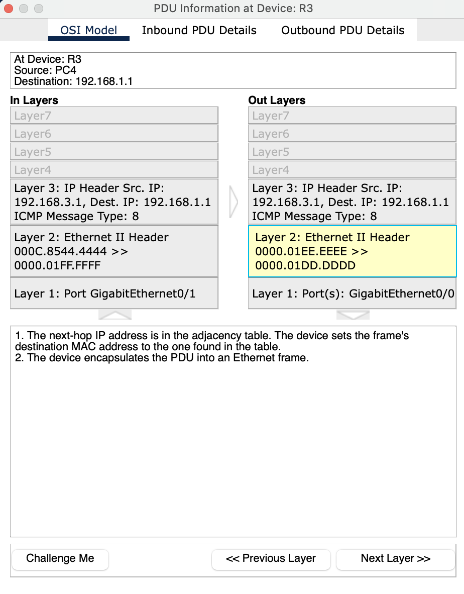
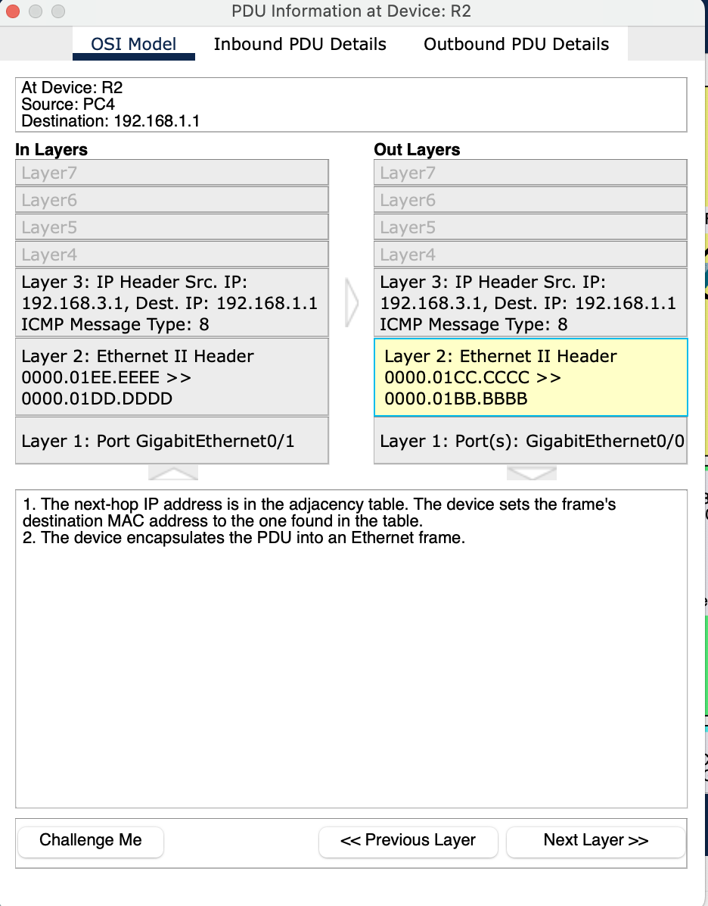
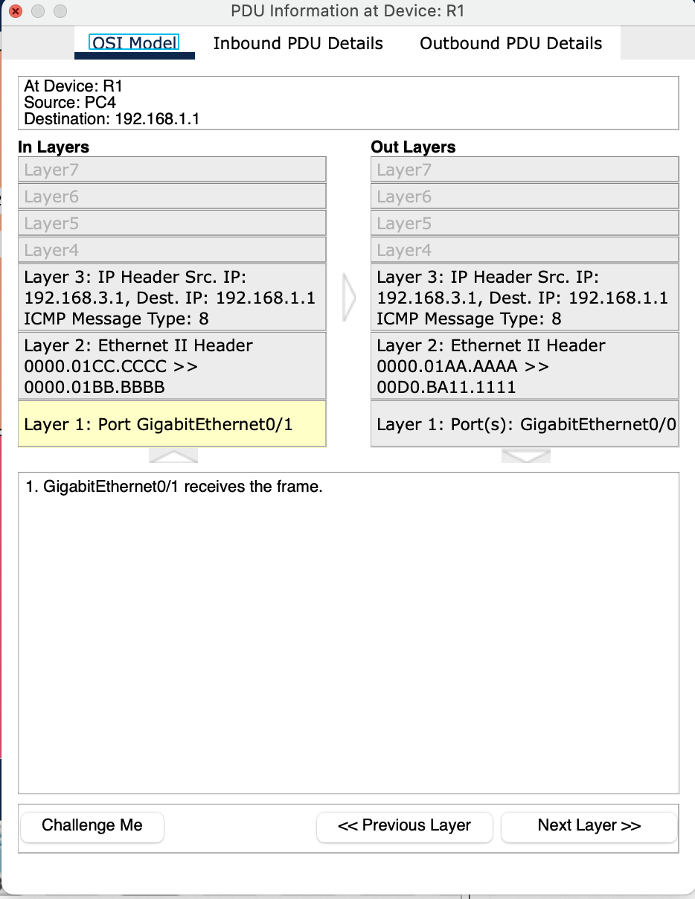
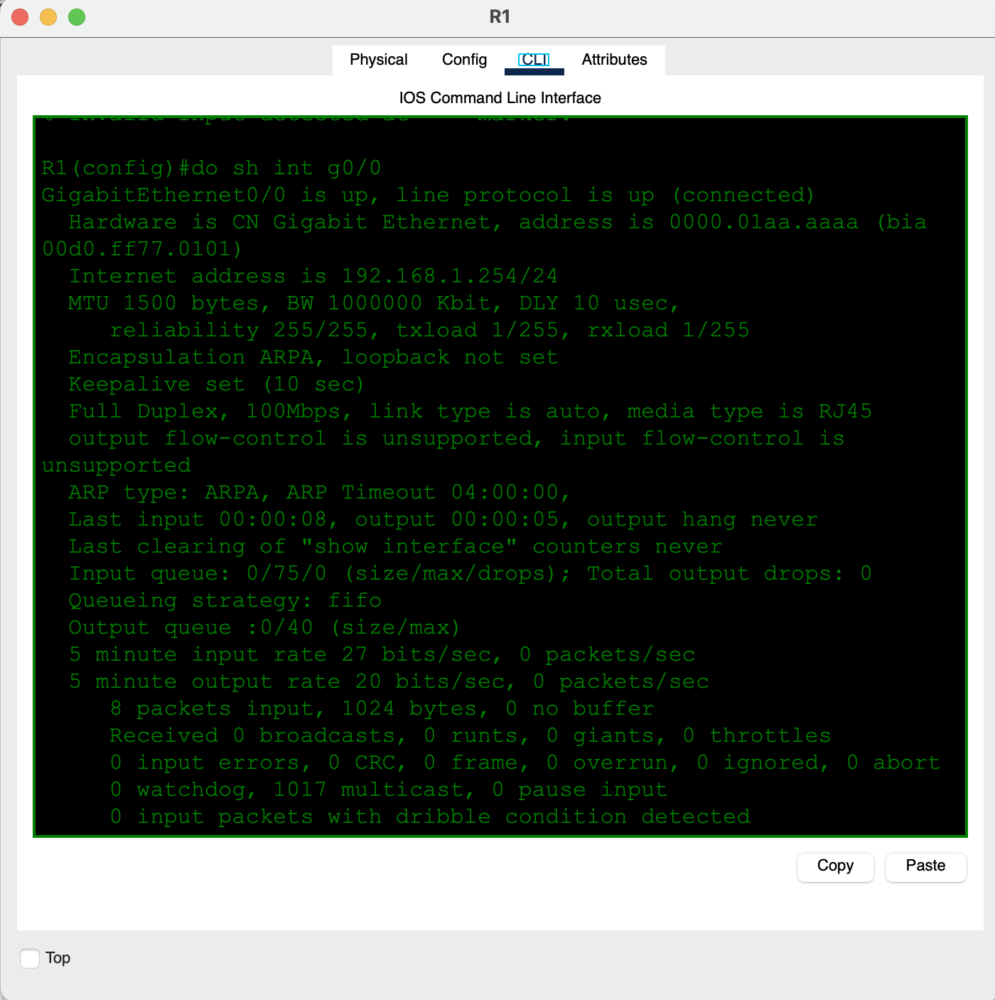
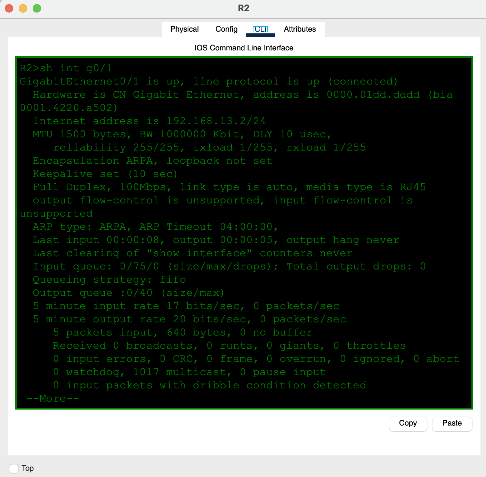
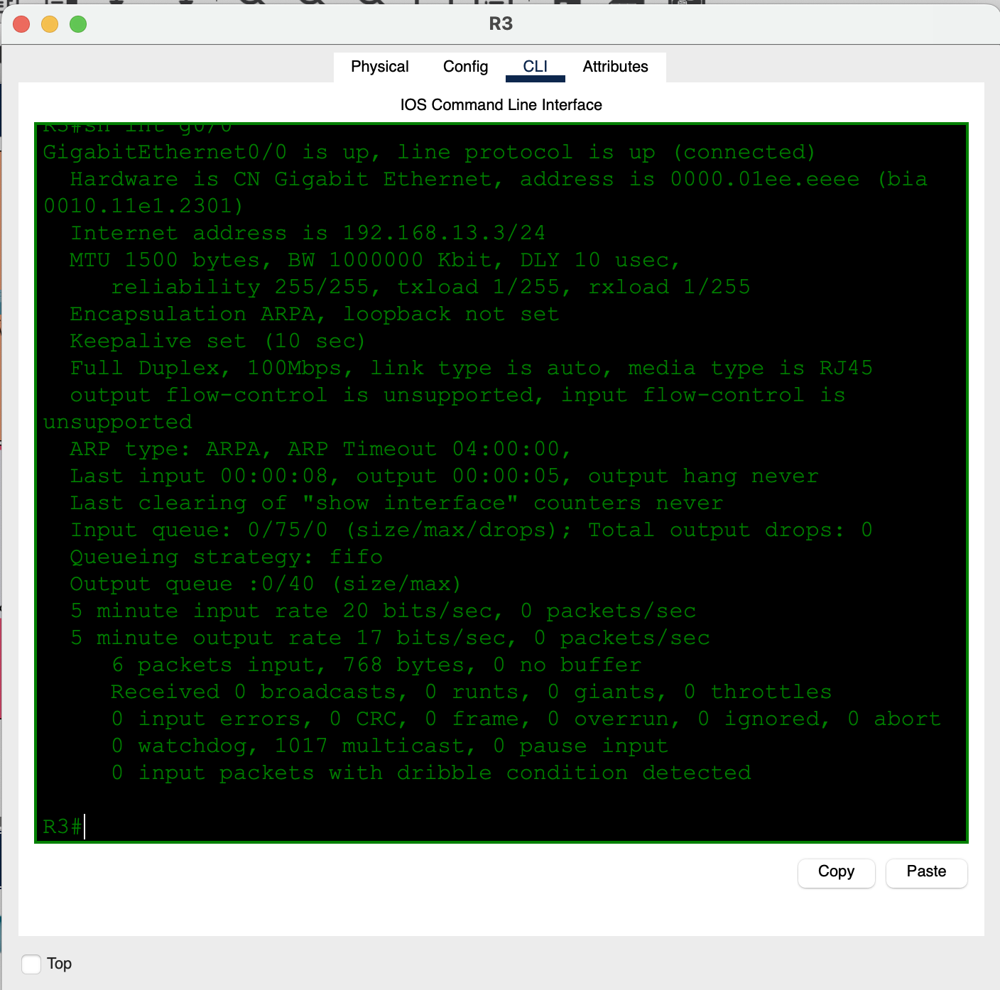

# Day 12 — Life of a Packet

**Topic:** Ethernet frames, IP packets, ARP, switching, and routing hop by hop
**Simulator:** Cisco Packet Tracer — `Day 12 Lab - Life of a Packet.pkt`
**Course reference:** Jeremy's IT Lab — CCNA 200-301, Day 12 (Life of a Packet)

---

## 🎯 Objective

Follow an ICMP Echo Request from PC4 (`192.168.3.1`) to PC1 (`192.168.1.1`) in Packet Tracer’s Simulation Mode. Identify what happens at each hop and distinguish the Layer 3 information that stays the same from the Layer 2 information that is rebuilt.

## 🗺️ Topology

Two LANs are connected through R1, R2, and R3:

- LAN 1: `192.168.1.0/24` — PC1, PC2, PC3 and SW1
- Transit links: `192.168.12.0/24` and `192.168.13.0/24`
- LAN 3: `192.168.3.0/24` — PC4, PC5, PC6 and SW2


## 🔬 Packet journey: PC4 → PC1

### 1 — PC4 creates the ICMP packet

PC4 sends `ping 192.168.1.1`. The destination is outside PC4’s local `192.168.3.0/24` subnet, so PC4 sends the frame to its default gateway (R3), not directly to PC1.

The new IP packet contains:

```
Source IP:      192.168.3.1
Destination IP: 192.168.1.1
ICMP type:      8 (Echo Request)
```


### 2 — The routers route the packet

At R3, R2, and R1, the IP header stays the same: source `192.168.3.1`, destination `192.168.1.1`, ICMP type 8. Each router removes the received Ethernet frame, makes its Layer 3 routing decision, then builds a **new Ethernet frame** for the next hop.

| Device | Incoming interface | Outgoing interface | Layer 2 result |
|---|---|---|---|
| R3 | G0/1 | G0/0 | New frame addressed to R2 |
| R2 | G0/1 | G0/0 | New frame addressed to R1 |
| R1 | G0/1 | G0/0 | New frame addressed toward SW1 / PC1 LAN |







### 3 — Switch forwarding

SW2 does not route the packet or change the IP header. It forwards the Ethernet frame out the access port selected from its MAC address table.


## 🧠 Key idea: what changes at each hop?

| Field | Routers | Switches |
|---|---|---|
| Source / destination IP | Preserved end-to-end (aside from TTL) | Preserved |
| ICMP type | Preserved | Preserved |
| Source / destination MAC | Removed and replaced for the next link | Kept in the forwarded frame |
| Outgoing interface | Chosen from routing table | Chosen from MAC address table |

The interface output confirms the MAC addresses used on the transit links:







## ✅ Verification

In Packet Tracer:

1. Switch to **Simulation** mode and filter for ICMP.
2. Ping once first to let ARP complete and the devices learn MAC addresses.
3. Send the ICMP packet again and step through the PDU event list.
4. At each router, confirm: same IP addresses; new Layer 2 source/destination MAC addresses.
5. At the switch, confirm the frame is sent through the selected access port.

## 💡 What I learned

An IP packet can travel end-to-end across several routed networks without changing its source or destination IP address. Ethernet frames do not: every router strips the incoming Layer 2 header and creates a new frame for the next link. Switches stay at Layer 2, forwarding the frame based on destination MAC and their MAC address table. ARP has to complete first so a device knows the MAC address needed for the local link.

## 📎 Files in this lab

- `README.md` — this writeup
- `day12-life-of-a-packet.pkt` — Packet Tracer save _(add your file)_
- `day12-topology.svg` and eight PDU/interface screenshots
