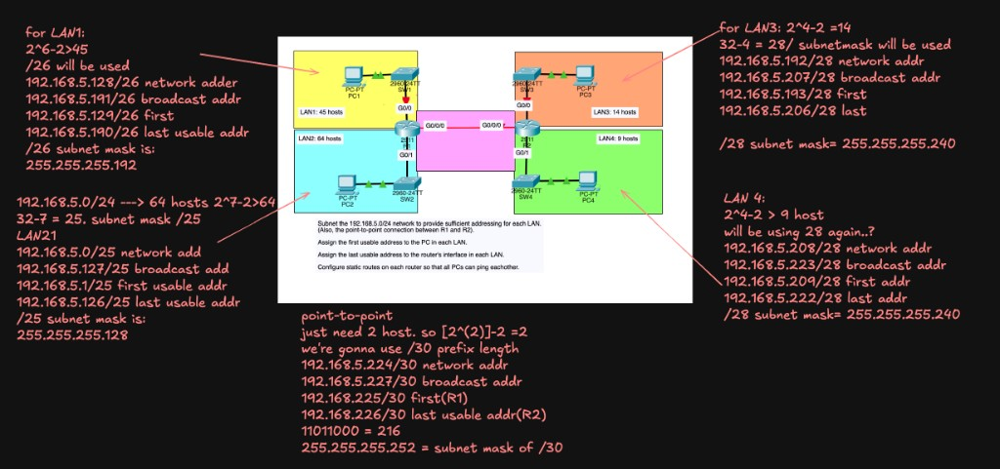
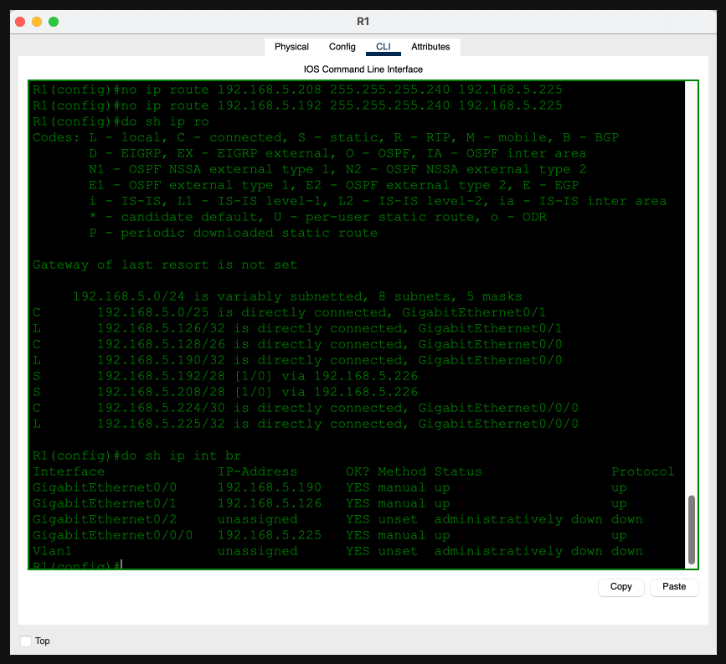
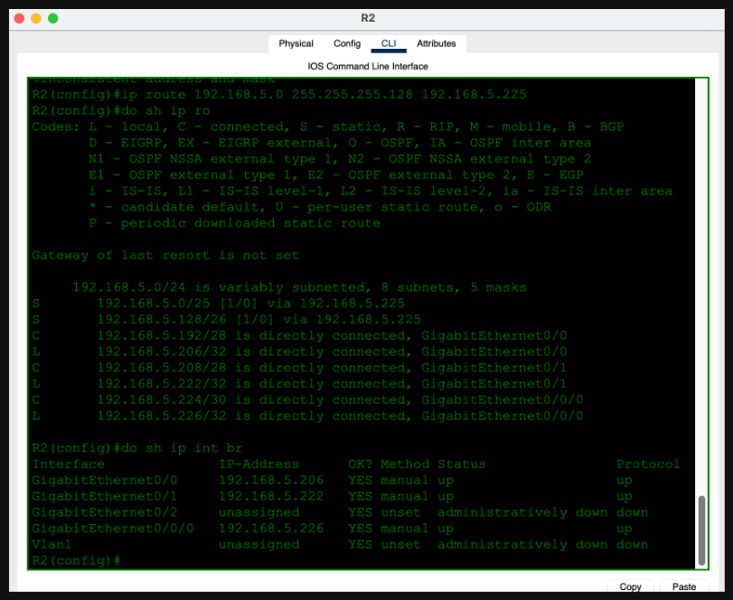
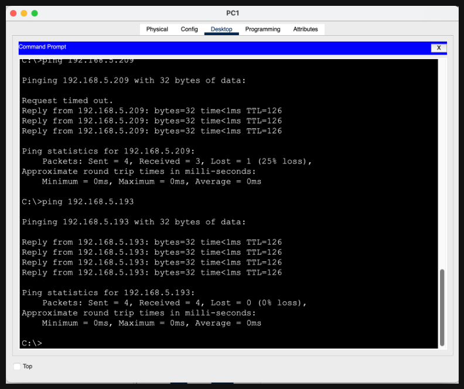
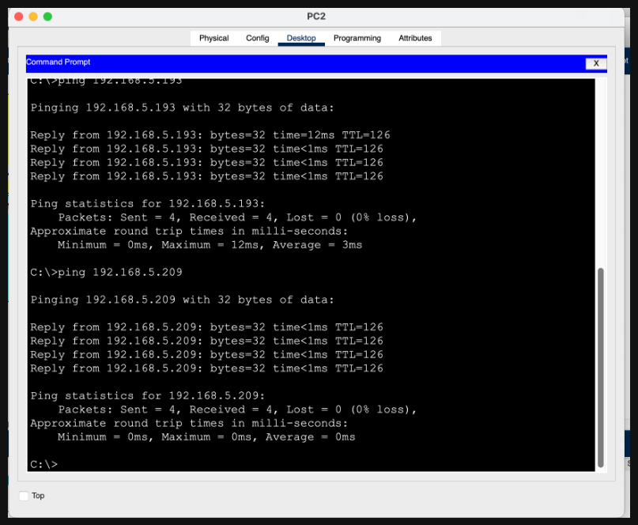
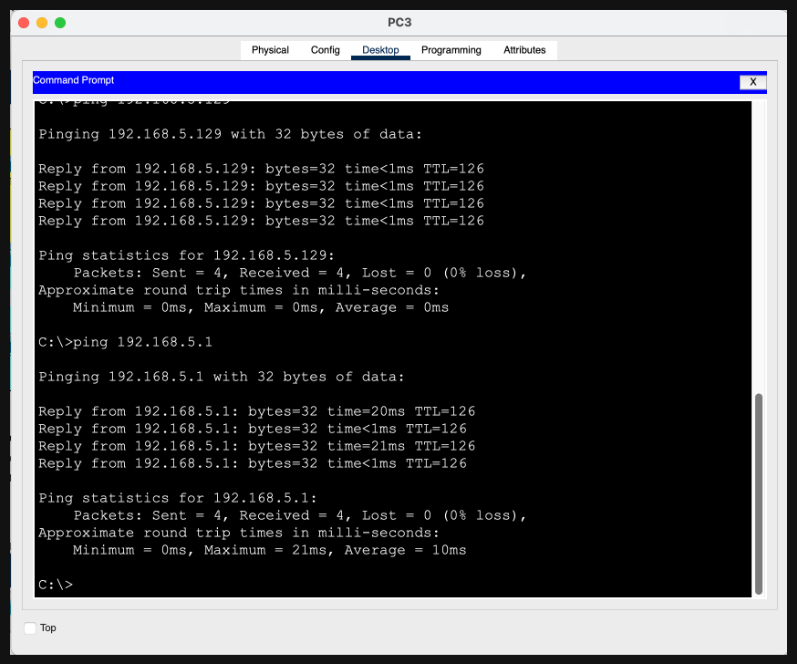
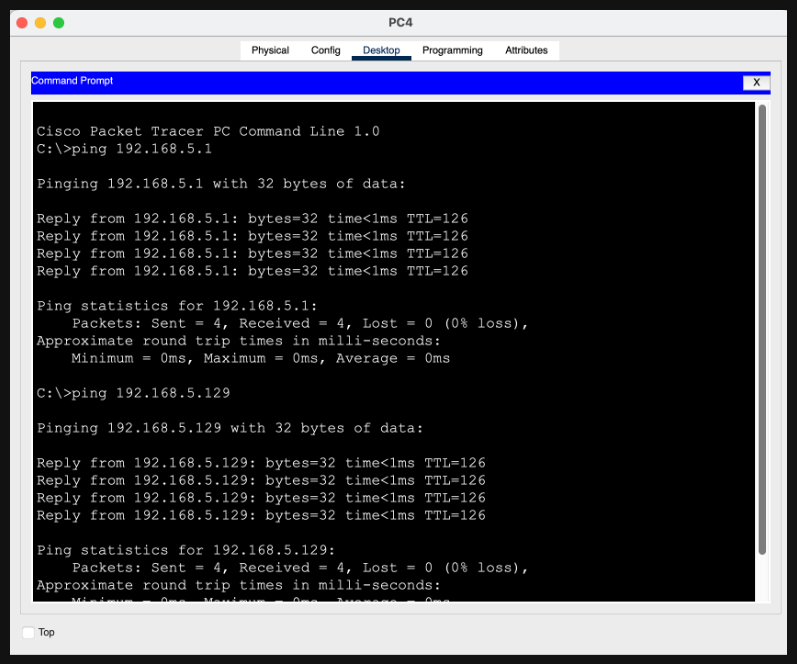

# Day 15 — VLSM (Variable Length Subnet Mask)

**Topic:** VLSM subnetting of `192.168.5.0/24`, interface addressing, and static routing
**Simulator:** Cisco Packet Tracer — `Day 15 Lab - VLSM.pkt`
**Course reference:** Jeremy's IT Lab — CCNA 200-301, Day 15 (VLSM)

---

## 🎯 Objective

> Subnet `192.168.5.0/24` so each LAN (and the R1–R2 point-to-point link) gets **just enough** addresses. Assign the **first usable** address to the PC in each LAN and the **last usable** address to the router interface. Then add static routes so every PC can ping every other PC.

## 🗺️ Topology

Two routers, four access LANs, and one `/30` transit link:

- **LAN 1** (45 hosts) — PC1 / SW1 / R1 G0/0
- **LAN 2** (64 hosts) — PC2 / SW2 / R1 G0/1
- **LAN 3** (14 hosts) — PC3 / SW3 / R2 G0/0
- **LAN 4** (9 hosts) — PC4 / SW4 / R2 G0/1
- **P2P** — R1 G0/0/0 ↔ R2 G0/0/0



## 🧠 Lesson: why VLSM?

**FLSM** (Fixed Length Subnet Mask) gives every subnet the same size. That wastes addresses: a 2-host WAN link does not need a `/25`, and a 64-host LAN does not fit in a `/28`.

**VLSM** lets you cut the same major network (`192.168.5.0/24`) into **different-sized** subnets. Design rule: **largest host requirement first**, then fill the leftover space with smaller blocks.

Host-bit formula:

```
usable hosts = 2^n - 2
prefix length = 32 - n
```

(`n` = host bits. Subtract 2 for the network and broadcast addresses.)

| LAN | Hosts needed | Host bits | Prefix | Usable | Mask |
|-----|-------------:|----------:|--------|-------:|------|
| LAN 2 | 64 | 7 | `/25` | 126 | `255.255.255.128` |
| LAN 1 | 45 | 6 | `/26` | 62 | `255.255.255.192` |
| LAN 3 | 14 | 4 | `/28` | 14 | `255.255.255.240` |
| LAN 4 | 9 | 4 | `/28` | 14 | `255.255.255.240` |
| P2P | 2 | 2 | `/30` | 2 | `255.255.255.252` |

LAN 3 lands on an exact fit (`2^4 - 2 = 14`). LAN 2 cannot use `/26` (`62` usable is too small), so it takes `/25`.

## 📐 Addressing plan

Carve `192.168.5.0/24` from the top of the address space downward:

| Block | Network | Broadcast | First usable (PC) | Last usable (router) | Mask |
|-------|---------|-----------|-------------------|----------------------|------|
| LAN 2 | `192.168.5.0/25` | `192.168.5.127` | `192.168.5.1` | `192.168.5.126` (R1 G0/1) | `255.255.255.128` |
| LAN 1 | `192.168.5.128/26` | `192.168.5.191` | `192.168.5.129` | `192.168.5.190` (R1 G0/0) | `255.255.255.192` |
| LAN 3 | `192.168.5.192/28` | `192.168.5.207` | `192.168.5.193` | `192.168.5.206` (R2 G0/0) | `255.255.255.240` |
| LAN 4 | `192.168.5.208/28` | `192.168.5.223` | `192.168.5.209` | `192.168.5.222` (R2 G0/1) | `255.255.255.240` |
| P2P | `192.168.5.224/30` | `192.168.5.227` | `192.168.5.225` (R1) | `192.168.5.226` (R2) | `255.255.255.252` |

Leftover: `192.168.5.228`–`192.168.5.255` (unused).

| Device | Interface | Address | Default gateway |
|--------|-----------|---------|-----------------|
| PC2 | Fa0 | `192.168.5.1/25` | `192.168.5.126` |
| R1 | G0/1 | `192.168.5.126/25` | — |
| PC1 | Fa0 | `192.168.5.129/26` | `192.168.5.190` |
| R1 | G0/0 | `192.168.5.190/26` | — |
| PC3 | Fa0 | `192.168.5.193/28` | `192.168.5.206` |
| R2 | G0/0 | `192.168.5.206/28` | — |
| PC4 | Fa0 | `192.168.5.209/28` | `192.168.5.222` |
| R2 | G0/1 | `192.168.5.222/28` | — |
| R1 | G0/0/0 | `192.168.5.225/30` | — |
| R2 | G0/0/0 | `192.168.5.226/30` | — |

## 🛠️ Configuration

### 1 — Address the router interfaces

**R1**
```
enable
configure terminal
interface g0/1
 ip address 192.168.5.126 255.255.255.128
 no shutdown
interface g0/0
 ip address 192.168.5.190 255.255.255.192
 no shutdown
interface g0/0/0
 ip address 192.168.5.225 255.255.255.252
 no shutdown
```

**R2**
```
enable
configure terminal
interface g0/0
 ip address 192.168.5.206 255.255.255.240
 no shutdown
interface g0/1
 ip address 192.168.5.222 255.255.255.240
 no shutdown
interface g0/0/0
 ip address 192.168.5.226 255.255.255.252
 no shutdown
```

On each PC: **Config → FastEthernet0 → Static** — first usable IP, matching mask, router as gateway.

### 2 — Static routes (classless — mask must match the subnet)

Connected routes cover only local LANs. Each router still needs the remote VLSM blocks via the far side of the `/30`.

**R1 — LAN 3 and LAN 4 through R2**
```
ip route 192.168.5.192 255.255.255.240 192.168.5.226
ip route 192.168.5.208 255.255.255.240 192.168.5.226
```

**R2 — LAN 2 and LAN 1 through R1**
```
ip route 192.168.5.0 255.255.255.128 192.168.5.225
ip route 192.168.5.128 255.255.255.192 192.168.5.225
```

`show ip route` then reports `192.168.5.0/24 is variably subnetted` — proof that one class C is now several different masks.

### 3 — Fixes I actually hit

**Wrong next-hop on R1.** The first static routes pointed at `192.168.5.225` (R1’s own G0/0/0). A next-hop must be the **neighbor**, not yourself:

```
no ip route 192.168.5.192 255.255.255.240 192.168.5.225
no ip route 192.168.5.208 255.255.255.240 192.168.5.225
ip route 192.168.5.192 255.255.255.240 192.168.5.226
ip route 192.168.5.208 255.255.255.240 192.168.5.226
```

**`%Inconsistent address and mask` on R2.** IOS rejects a static route when the network address has host bits set for that mask. Use the real network number (`192.168.5.0` for `/25`, `192.168.5.128` for `/26`), never a host address.





## ✅ Verification

Every PC pings a host on the other router (and a second LAN on the far side):

| From | Ping | Result |
|------|------|--------|
| PC1 (`192.168.5.129`) | `192.168.5.209` (PC4), `192.168.5.193` (PC3) | success |
| PC2 (`192.168.5.1`) | `192.168.5.193` (PC3), `192.168.5.209` (PC4) | success |
| PC3 (`192.168.5.193`) | `192.168.5.129` (PC1), `192.168.5.1` (PC2) | success |
| PC4 (`192.168.5.209`) | `192.168.5.1` (PC2), `192.168.5.129` (PC1) | success |









| Check | Expected result |
|---|---|
| R1 `show ip int brief` | G0/0 `.190`, G0/1 `.126`, G0/0/0 `.225` — all `up/up` |
| R2 `show ip int brief` | G0/0 `.206`, G0/1 `.222`, G0/0/0 `.226` — all `up/up` |
| R1 `show ip route` | `C` LAN 1 `/26`, LAN 2 `/25`, P2P `/30`; `S` LAN 3 `/28` and LAN 4 `/28` via `.226` |
| R2 `show ip route` | `C` LAN 3 `/28`, LAN 4 `/28`, P2P `/30`; `S` LAN 2 `/25` and LAN 1 `/26` via `.225` |
| First ping after a change | One timeout is normal (ARP); repeat for `0% loss` |

## 💡 What I learned

VLSM is just subnetting applied more than once: pick the smallest prefix that still covers the host count, then take the next free block. A `/24` that would be one wasteful LAN becomes five correctly sized networks plus leftover space. Static routes have to carry the **exact VLSM mask** — a classful `/24` route to `192.168.5.0` would be wrong here because that prefix is no longer a single subnet. I also re-learned two routing gotchas from Day 11: next-hop is the neighbor’s IP, and the first ping can drop while ARP runs.

## 📎 Files in this lab

- `README.md` — this writeup
- `day15-vlsm.pkt` — Packet Tracer save (`Day 15 Lab - VLSM.pkt`)
- `day15-topology.png` — annotated topology (main photo)
- `day15-r1-routes.png`, `day15-r2-routes.png` — CLI verification
- `day15-pc1-ping.png` … `day15-pc4-ping.png` — end-to-end pings
