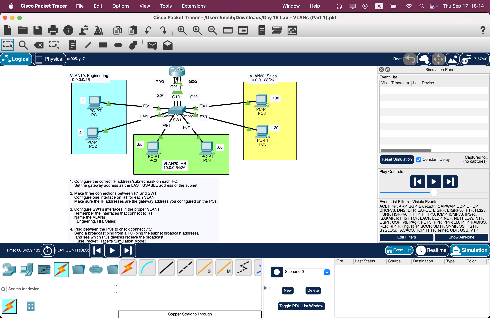
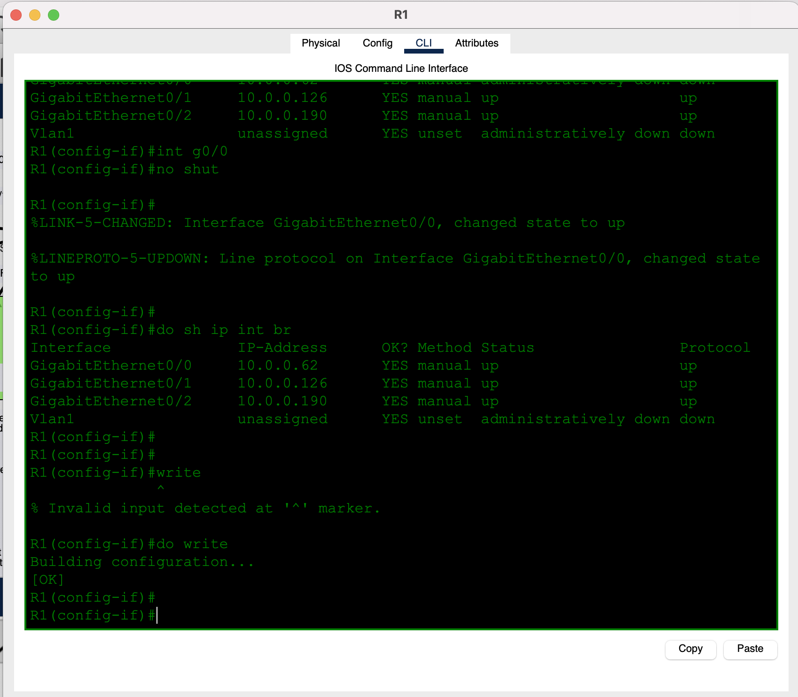
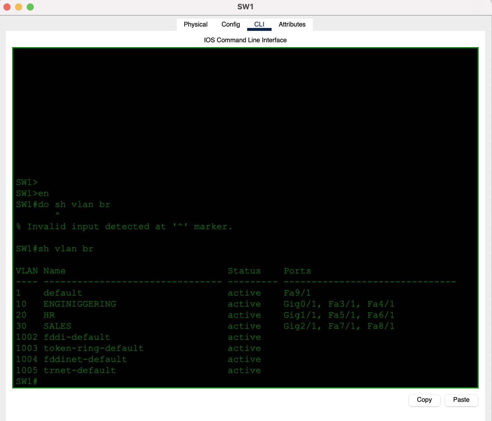
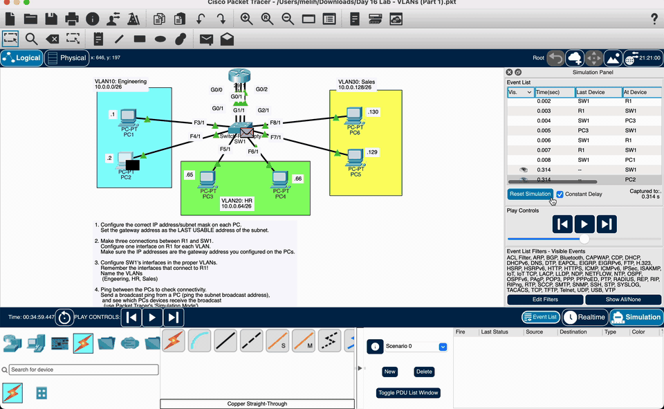
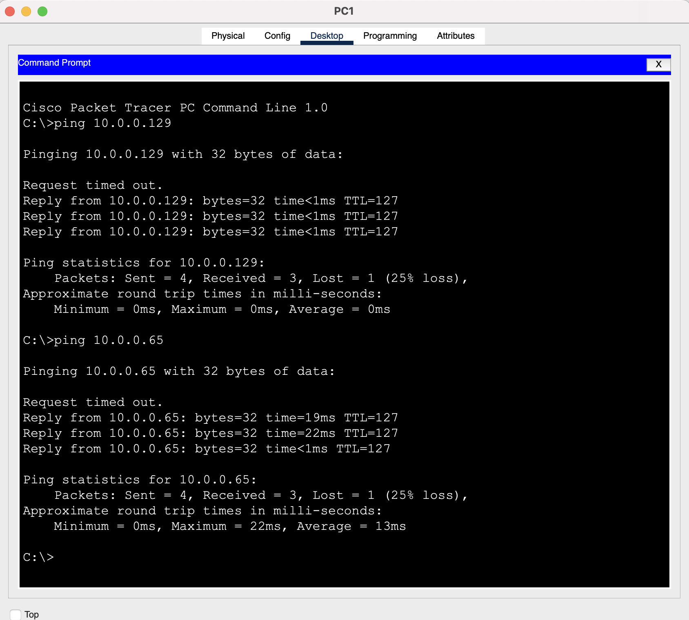
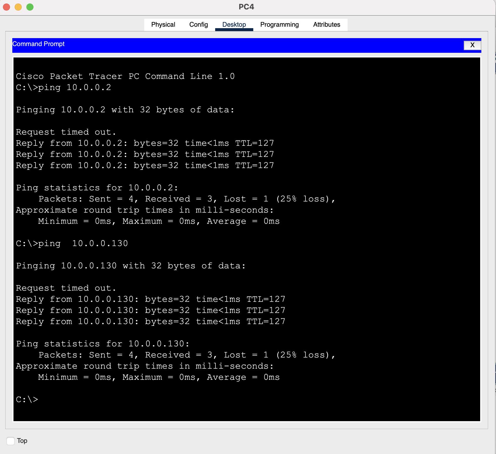
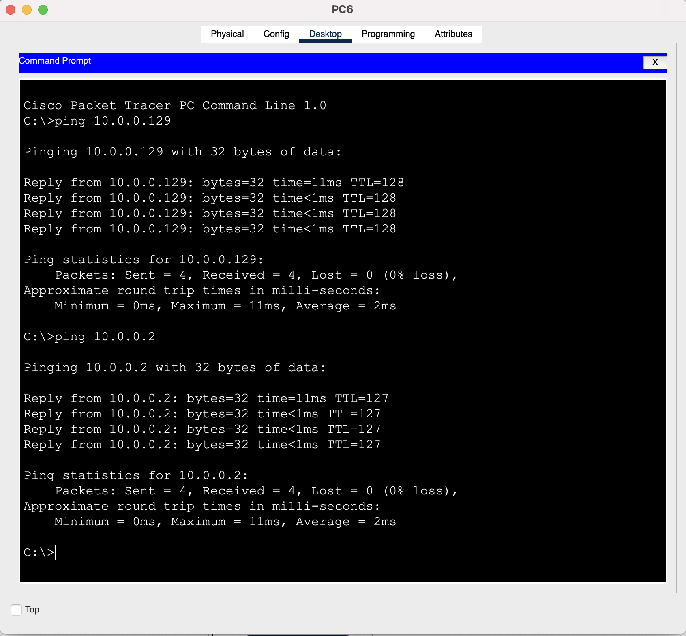

# Day 16 — VLANs (Part 1)

**Topic:** Access VLANs, separate broadcast domains, and inter-VLAN routing over three physical links
**Simulator:** Cisco Packet Tracer — `Day 16 Lab - VLANs (Part 1).pkt`
**Course reference:** Jeremy's IT Lab — CCNA 200-301, Day 16 (VLANs)

---

## 🎯 Objective

> Split one switch into three VLANs (Engineering, HR, Sales). Address each PC with the subnet’s first usable IPs and set the **last usable** address as the gateway. Connect **one R1 interface per VLAN**, assign SW1 access ports (including the three links to R1), then prove that same-VLAN traffic stays Layer 2 while different-VLAN traffic is routed.

## 🗺️ Topology

SW1 sits in the middle. R1 uses three separate Gigabit links — not a trunk — so each VLAN has its own router interface:

- **VLAN 10 Engineering** `10.0.0.0/26` — PC1 `.1`, PC2 `.2` (SW1 F3/1, F4/1 → R1 G0/0)
- **VLAN 20 HR** `10.0.0.64/26` — PC3 `.65`, PC4 `.66` (SW1 F5/1, F6/1 → R1 G0/1)
- **VLAN 30 Sales** `10.0.0.128/26` — PC5 `.129`, PC6 `.130` (SW1 F7/1, F8/1 → R1 G0/2)



## 🧠 Lesson: what a VLAN actually does

A **VLAN** is a Layer-2 broadcast domain. Ports in VLAN 10 do not flood frames to ports in VLAN 20, even on the same switch. Without a router (or Layer-3 switch), PCs in different VLANs cannot ping each other.

This lab is **access ports only**. Each SW1 port belongs to exactly one VLAN (`switchport mode access`). The three cables to R1 are also access ports — one VLAN per cable. Router-on-a-stick / 802.1Q trunking is the next step, not this lab.

TTL is the giveaway:

| Ping | Path | TTL in the reply |
|------|------|------------------|
| Same VLAN (PC6 → PC5) | Switch only | **128** |
| Different VLAN (PC6 → PC2) | Host → R1 → other VLAN | **127** |

## 📐 Addressing

Every subnet is `/26` (mask `255.255.255.192`). Gateway = last usable.

| VLAN | Name | Network | Broadcast | PC addresses | Gateway (R1) | R1 interface |
|------|------|---------|-----------|--------------|--------------|--------------|
| 10 | Engineering | `10.0.0.0/26` | `10.0.0.63` | PC1 `.1`, PC2 `.2` | `10.0.0.62` | G0/0 |
| 20 | HR | `10.0.0.64/26` | `10.0.0.127` | PC3 `.65`, PC4 `.66` | `10.0.0.126` | G0/1 |
| 30 | Sales | `10.0.0.128/26` | `10.0.0.191` | PC5 `.129`, PC6 `.130` | `10.0.0.190` | G0/2 |

## 🛠️ Configuration

### 1 — Address the PCs

On each PC → **Config → FastEthernet0 → Static**: matching `/26` mask, gateway = last usable of **that** VLAN.

### 2 — One R1 interface per VLAN

```
enable
configure terminal
interface g0/0
 ip address 10.0.0.62 255.255.255.192
 no shutdown
interface g0/1
 ip address 10.0.0.126 255.255.255.192
 no shutdown
interface g0/2
 ip address 10.0.0.190 255.255.255.192
 no shutdown
```

`write` is invalid in config-if mode on this IOS. From there, save with `do write` (or `end` then `write`).



### 3 — Create VLANs and assign access ports on SW1

Include the **router-facing** Gigabit ports. If those stay in VLAN 1, R1 never sees VLAN 10/20/30 traffic.

```
enable
configure terminal
vlan 10
 name Engineering
vlan 20
 name HR
vlan 30
 name Sales
exit

interface range f3/1, f4/1, g0/1
 switchport mode access
 switchport access vlan 10

interface range f5/1, f6/1, g1/1
 switchport mode access
 switchport access vlan 20

interface range f7/1, f8/1, g2/1
 switchport mode access
 switchport access vlan 30
```

Packet Tracer’s switch IOS here does **not** accept `do` (`do sh vlan br` → invalid). Run `show vlan brief` from privileged EXEC.



> VLAN 10’s name in the table is `ENGINIGGEERING` — a typo while naming. Forwarding uses the **VLAN ID**, so pings still work. Rename later with `vlan 10` → `name Engineering`.

### 4 — Watch it in Simulation Mode

A same-VLAN ping never leaves SW1. A different-VLAN ping must go **PC → SW1 → R1 → SW1 → other PC**, then the ICMP reply comes back the same way. The recording shows PC2 (`10.0.0.2`, VLAN 10) reaching PC6 (`10.0.0.130`, VLAN 30) through R1.



A ping to the subnet broadcast (VLAN 10 = `10.0.0.63`, VLAN 20 = `10.0.0.127`, VLAN 30 = `10.0.0.191`) is flooded only inside that VLAN.

## ✅ Verification

| From | Ping | Result | Notes |
|------|------|--------|-------|
| PC1 (`10.0.0.1`) | `10.0.0.129` (PC5), `10.0.0.65` (PC3) | 3/4 replies | Inter-VLAN via R1; first drop is ARP |
| PC4 (`10.0.0.66`) | `10.0.0.2` (PC2), `10.0.0.130` (PC6) | 3/4 replies | Same ARP behaviour |
| PC6 (`10.0.0.130`) | `10.0.0.129` (PC5) | 4/4, TTL **128** | Same VLAN — no router |
| PC6 (`10.0.0.130`) | `10.0.0.2` (PC2) | 4/4, TTL **127** | Routed |







| Check | Expected |
|-------|----------|
| R1 `show ip int brief` | G0/0 `.62`, G0/1 `.126`, G0/2 `.190` — `up/up` |
| SW1 `show vlan brief` | VLAN 10: F3/1, F4/1, G0/1 · VLAN 20: F5/1, F6/1, G1/1 · VLAN 30: F7/1, F8/1, G2/1 |
| Same-VLAN ping | TTL 128 |
| Different-VLAN ping | TTL 127; needs the correct gateway on the PC |

## 💡 What I learned

VLANs carve one switch into isolated Layer-2 networks. Hosts on the same VLAN talk through the switch alone; hosts on different VLANs must hit a router, even if they are plugged into the same SW1. Putting the R1 uplinks in the matching access VLAN is as important as putting the PCs there — a router port left in VLAN 1 is a black hole. I also learned that VLAN **names** are documentation (`ENGINIGGEERING` still forwards as VLAN 10), that Packet Tracer switches may not support `do`, and that `write` has to be run from exec (or with `do write` on the router).

## 📎 Files in this lab

- `README.md` — this writeup
- `day16-vlans.pkt` — Packet Tracer save (`Day 16 Lab - VLANs (Part 1).pkt`)
- `day16-topology.png` — topology (main photo)
- `day16-simulation.gif` — Simulation Mode: PC2 → R1 → PC6 and the reply
- `day16-r1-interfaces.png`, `day16-sw1-vlans.png` — CLI verification
- `day16-pc1-ping.png`, `day16-pc4-ping.png`, `day16-pc6-ping.png` — pings
