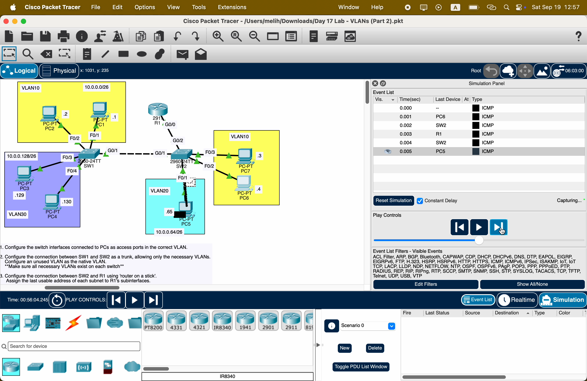
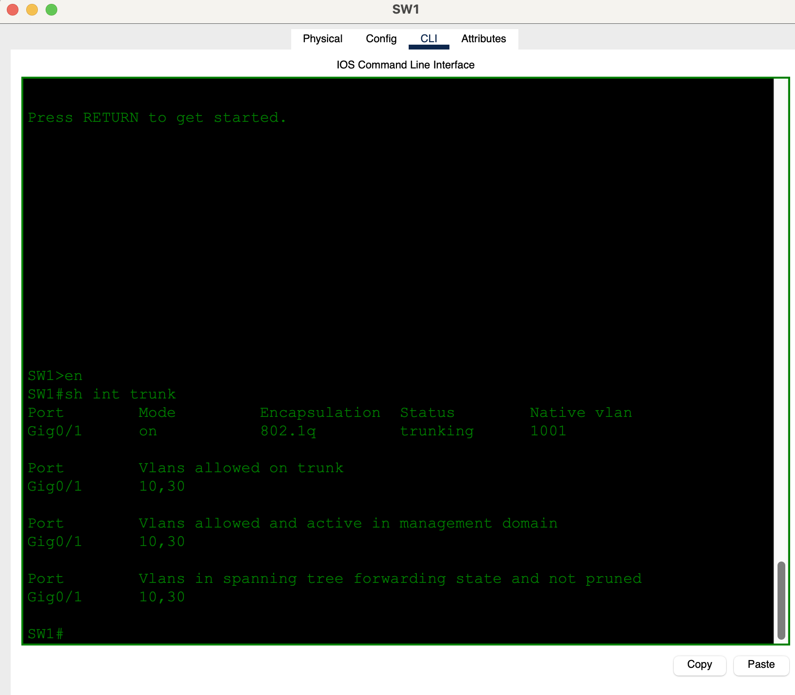
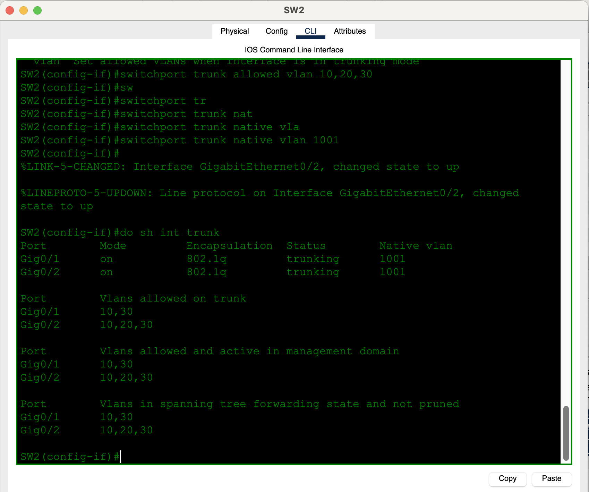
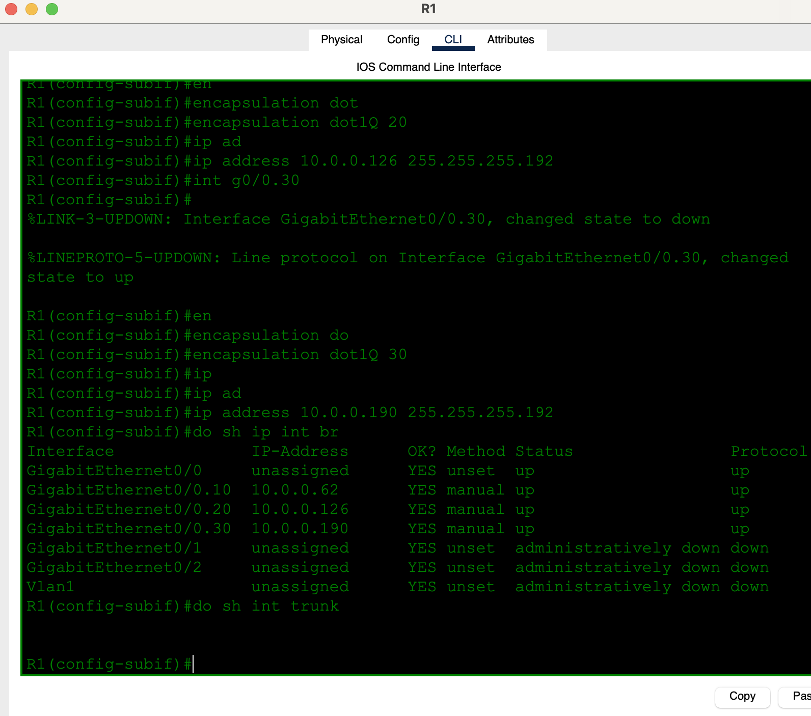
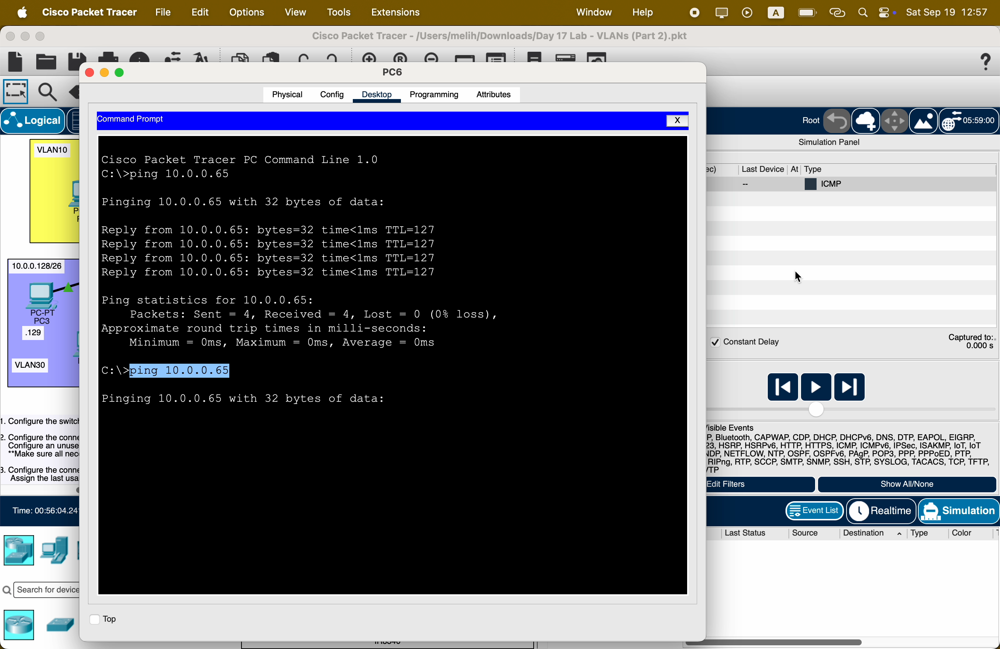
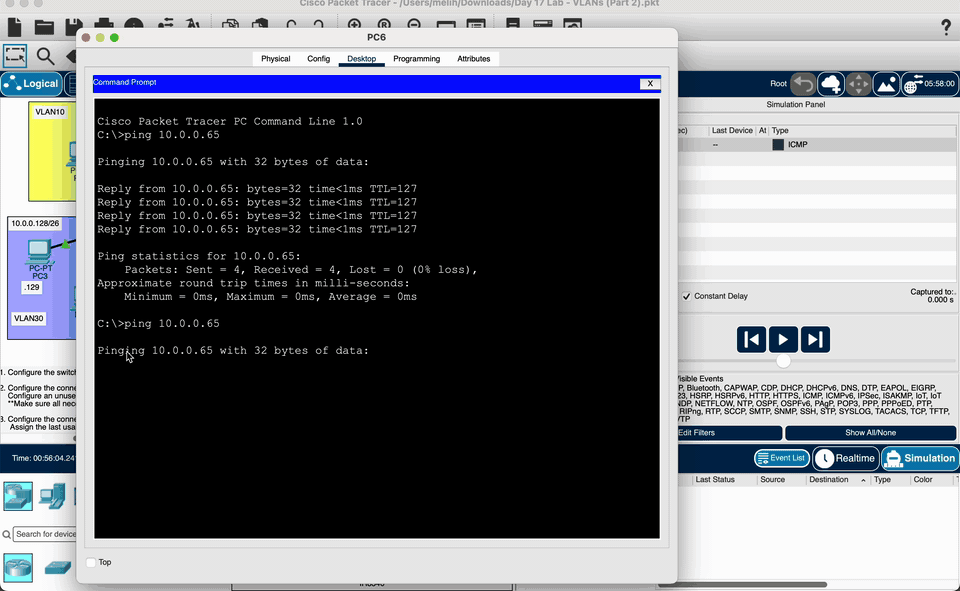

# Day 17 — VLANs (Part 2)

**Topic:** 802.1Q trunks, native VLAN, allowed-VLAN lists, and router-on-a-stick
**Simulator:** Cisco Packet Tracer — `Day 17 Lab - VLANs (Part 2).pkt`
**Course reference:** Jeremy's IT Lab — CCNA 200-301, Day 17 (VLANs / trunking)

---

## 🎯 Objective

> Day 16 used **three cables** from the switch to the router (one per VLAN). This lab replaces that with **one trunk** to R1 (**router-on-a-stick**) and a second trunk between SW1 and SW2. Access ports stay in the correct VLAN, the unused VLAN becomes the **native VLAN**, and each trunk allows **only** the VLANs that actually need to cross it.

## 🗺️ Topology

Same three `/26` subnets as Day 16, now split across two switches:

- **VLAN 10** `10.0.0.0/26` — PC1 `.1`, PC2 `.2` on SW1; PC7 `.3`, PC6 `.4` on SW2
- **VLAN 20** `10.0.0.64/26` — PC5 `.65` on SW2 only
- **VLAN 30** `10.0.0.128/26` — PC3 `.129`, PC4 `.130` on SW1
- **SW1 G0/1 ↔ SW2 G0/1** — trunk (VLANs 10 and 30)
- **SW2 G0/2 ↔ R1 G0/0** — trunk for ROAS (VLANs 10, 20, 30)



## 🧠 Lesson: access vs trunk vs ROAS

An **access port** carries one VLAN, untagged. A **trunk** carries many VLANs. 802.1Q inserts a 4-byte tag so the far end knows which VLAN the frame belongs to.

The **native VLAN** is the exception: it crosses the trunk **untagged**. Default native VLAN is 1. Best practice is an unused VLAN (here **1001**) so ordinary user traffic is never the untagged VLAN.

**Router-on-a-stick** puts one subinterface per VLAN on a single router port (`G0/0.10`, `G0/0.20`, `G0/0.30`). The physical interface has **no IP**. Each subinterface needs `encapsulation dot1Q <vlan>` **before** the IP address.

The SW1–SW2 trunk does **not** need VLAN 20: HR lives only on SW2. Allowing only 10 and 30 is both cleaner and what the lab asks for.

## 📐 Addressing

Gateway = last usable. Mask `255.255.255.192` (`/26`).

| VLAN | Network | Broadcast | Hosts | Gateway (R1 subif) |
|------|---------|-----------|-------|--------------------|
| 10 | `10.0.0.0/26` | `10.0.0.63` | PC1 `.1`, PC2 `.2`, PC7 `.3`, PC6 `.4` | `10.0.0.62` (`G0/0.10`) |
| 20 | `10.0.0.64/26` | `10.0.0.127` | PC5 `.65` | `10.0.0.126` (`G0/0.20`) |
| 30 | `10.0.0.128/26` | `10.0.0.191` | PC3 `.129`, PC4 `.130` | `10.0.0.190` (`G0/0.30`) |

## 🛠️ Configuration

### 1 — Access ports on SW1 and SW2

Create the VLANs (including unused **1001**), then assign PC ports.

**SW1**
```
vlan 10
vlan 30
vlan 1001
interface range f0/1 - 2
 switchport mode access
 switchport access vlan 10
interface range f0/3 - 4
 switchport mode access
 switchport access vlan 30
```

**SW2**
```
vlan 10
vlan 20
vlan 30
vlan 1001
interface f0/1
 switchport mode access
 switchport access vlan 20
interface range f0/2 - 3
 switchport mode access
 switchport access vlan 10
```

### 2 — SW1 ↔ SW2 trunk (only VLANs 10 and 30)

```
interface g0/1
 switchport mode trunk
 switchport trunk native vlan 1001
 switchport trunk allowed vlan 10,30
```

Do this on **both** SW1 G0/1 and SW2 G0/1. Native VLAN must match on both ends.



### 3 — SW2 ↔ R1 trunk + router-on-a-stick

**SW2 G0/2** (needs every VLAN that R1 routes):
```
interface g0/2
 switchport mode trunk
 switchport trunk native vlan 1001
 switchport trunk allowed vlan 10,20,30
```

I first typed `switchport trunk native vlan 10001` — too many zeros. Correct ID is **1001**.



**R1** — physical port up, IPs on subinterfaces:
```
interface g0/0
 no shutdown
interface g0/0.10
 encapsulation dot1Q 10
 ip address 10.0.0.62 255.255.255.192
interface g0/0.20
 encapsulation dot1Q 20
 ip address 10.0.0.126 255.255.255.192
interface g0/0.30
 encapsulation dot1Q 30
 ip address 10.0.0.190 255.255.255.192
```

`encapsulation` must come before `ip address`. `show interfaces trunk` is a **switch** command — on R1 it returns nothing.



## ✅ Verification

PC6 (`10.0.0.4`, VLAN 10 on SW2) pings PC5 (`10.0.0.65`, VLAN 20 on the same switch). Same switch, different VLAN → the packet still has to go **to R1 and back**. TTL **127**.



Simulation Mode shows that path: PC6 → SW2 → R1 → SW2 → PC5, then the ICMP reply the other way.



| Check | Expected |
|-------|----------|
| SW1 `show int trunk` | G0/1 802.1Q, native **1001**, allowed **10,30** |
| SW2 `show int trunk` | G0/1 allowed 10,30; G0/2 allowed 10,20,30; native 1001 |
| R1 `show ip int brief` | G0/0 unassigned `up/up`; `.10` `.62`, `.20` `.126`, `.30` `.190` all `up/up` |
| PC6 → PC5 | 4 replies, TTL 127 |
| Same-VLAN across the SW1–SW2 trunk (e.g. PC1 → PC6) | Layer 2 only — no R1 hop |

## 💡 What I learned

A trunk lets many VLANs share one cable; 802.1Q tags every frame except the native VLAN. Changing the native VLAN to unused **1001** (and matching it on both ends) keeps VLAN 1 off the untagged path. The allowed list should be the VLANs that actually exist on that link — VLAN 20 has no reason to ride SW1–SW2. Router-on-a-stick collapses Day 16’s three router cables into one: the physical interface stays unnumbered, each subinterface tags its VLAN and owns the last usable gateway address. `show interfaces trunk` is how you prove the switch side; on the router you prove it with `show ip interface brief` on the subinterfaces.

## 📎 Files in this lab

- `README.md` — this writeup
- `day17-vlans.pkt` — Packet Tracer save (`Day 17 Lab - VLANs (Part 2).pkt`)
- `day17-topology.png` — topology (main photo)
- `day17-simulation.gif` — Simulation Mode: PC6 → R1 → PC5
- `day17-sw1-trunk.png`, `day17-sw2-trunk.png`, `day17-r1-roas.png` — CLI
- `day17-pc6-ping.png` — inter-VLAN ping
