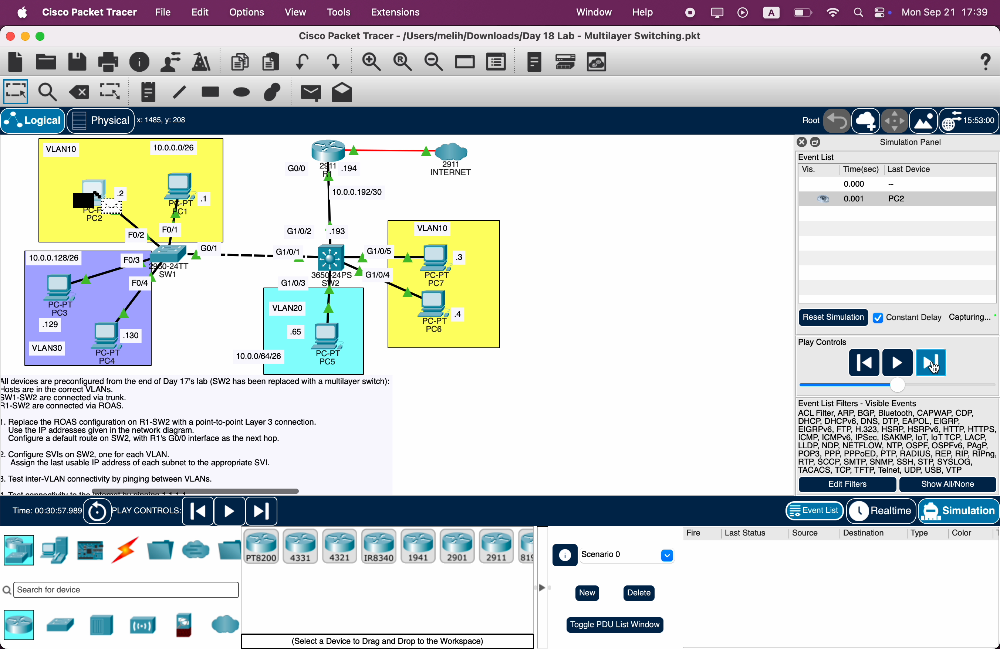
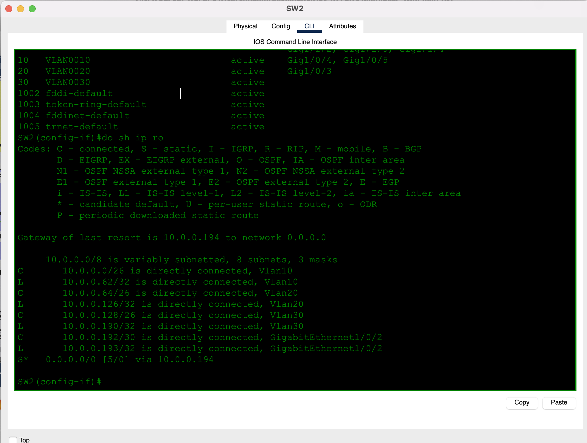
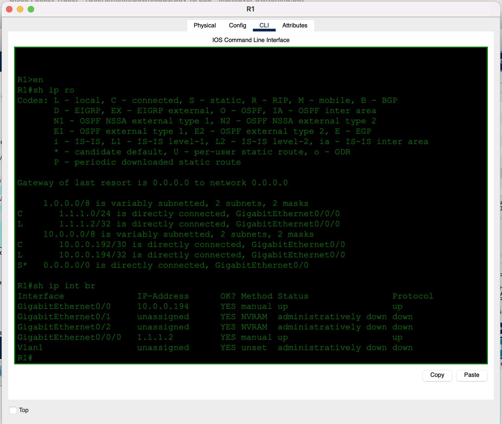
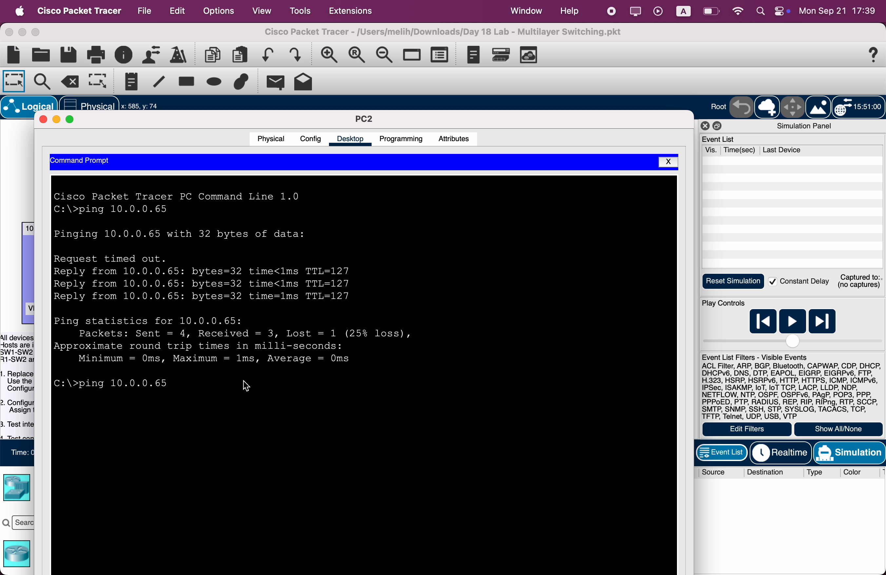
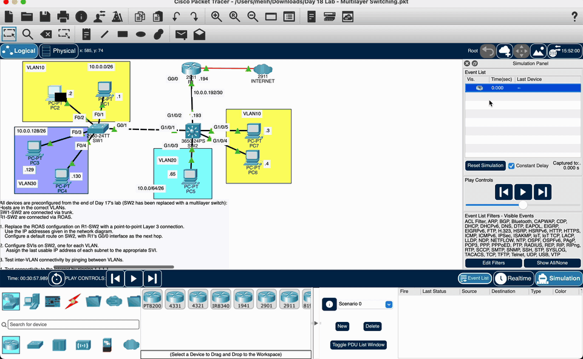
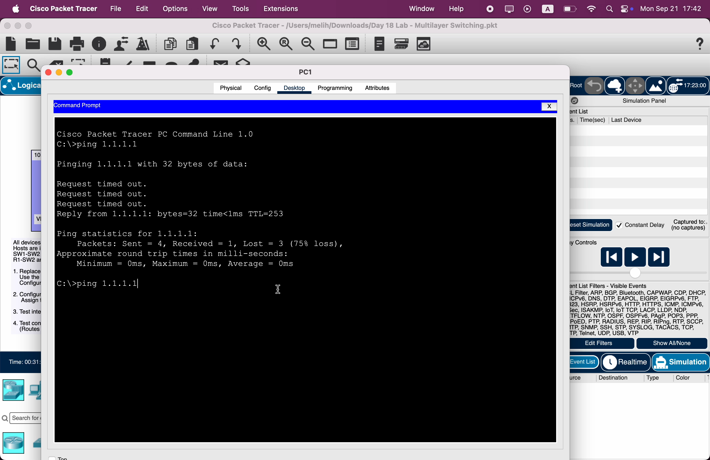
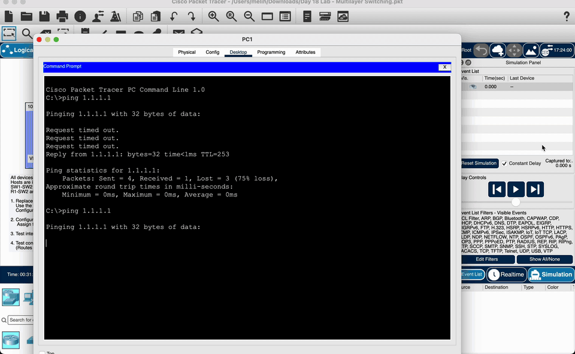

# Day 18 — Multilayer Switching

**Topic:** SVIs, routed ports, `ip routing`, and replacing ROAS with an L3 switch
**Simulator:** Cisco Packet Tracer — `Day 18 Lab - Multilayer Switching.pkt`
**Course reference:** Jeremy's IT Lab — CCNA 200-301, Day 18 (Multilayer Switching)

---

## 🎯 Objective

> Start from the end of Day 17, with **SW2 replaced by a multilayer switch (3650)**. Tear down router-on-a-stick. Put a **/30 Layer-3 link** between SW2 and R1, give SW2 an SVI (last usable address) for every VLAN, point SW2’s default route at R1, then prove both **inter-VLAN** pings and **Internet** (`1.1.1.1`).

## 🗺️ Topology

Same three access VLANs as Days 16–17. SW1 stays a Layer-2 2960; SW2 is now the router for those VLANs.

- **VLAN 10** `10.0.0.0/26` — PC1 `.1`, PC2 `.2` (SW1); PC7 `.3`, PC6 `.4` (SW2)
- **VLAN 20** `10.0.0.64/26` — PC5 `.65` (SW2)
- **VLAN 30** `10.0.0.128/26` — PC3 `.129`, PC4 `.130` (SW1)
- **SW1 G0/1 ↔ SW2 G1/0/1** — 802.1Q trunk (unchanged)
- **SW2 G1/0/2 ↔ R1 G0/0** — routed `/30` `10.0.0.192/30` (**.193** / **.194**)
- **R1 G0/0/0** — toward the Internet cloud (`1.1.1.0/24`)



## 🧠 Lesson: the switch becomes the router

Day 17 sent every inter-VLAN packet **up to R1 and back** (ROAS). A multilayer switch does that locally:

| | Day 17 ROAS | Day 18 MLS |
|---|---|---|
| Inter-VLAN gateway | R1 subinterfaces | SW2 **SVIs** (`interface vlan 10` …) |
| SW2 ↔ R1 | Trunk + 802.1Q tags | **Routed port** (`no switchport`) + `/30` |
| Extra command | `encapsulation dot1Q` | **`ip routing`** on SW2 |
| Inter-VLAN path | PC → SW → R1 → SW → PC | PC → SW2 (SVI in, SVI out) |

An **SVI** is a virtual Layer-3 interface bound to a VLAN. Hosts still use the last usable address as their gateway — that IP now lives on SW2, not on R1.

A **routed port** is a switch port taken out of L2 (`no switchport`) so it can take an IP like a router interface. That is the SW2–R1 link.

## 📐 Addressing

| Network | Mask | Role | Address |
|---------|------|------|---------|
| `10.0.0.0/26` | `255.255.255.192` | VLAN 10 SVI / PCs `.1–.4` | SW2 Vlan10 = **`10.0.0.62`** |
| `10.0.0.64/26` | `255.255.255.192` | VLAN 20 SVI / PC5 `.65` | SW2 Vlan20 = **`10.0.0.126`** |
| `10.0.0.128/26` | `255.255.255.192` | VLAN 30 SVI / PCs `.129–.130` | SW2 Vlan30 = **`10.0.0.190`** |
| `10.0.0.192/30` | `255.255.255.252` | L3 link | SW2 G1/0/2 **`.193`**, R1 G0/0 **`.194`** |
| `1.1.1.0/24` | `255.255.255.0` | Internet | R1 G0/0/0 **`1.1.1.2`**, ping **`1.1.1.1`** |

## 🛠️ Configuration

### 1 — Replace ROAS with a point-to-point L3 link

On SW2, turn G1/0/2 into a routed port. On R1, put a normal IP on G0/0 and drop the subinterfaces.

**SW2**
```
enable
configure terminal
ip routing
interface g1/0/2
 no switchport
 ip address 10.0.0.193 255.255.255.252
 no shutdown
ip route 0.0.0.0 0.0.0.0 10.0.0.194
```

**R1**
```
interface g0/0
 no ip address
 ip address 10.0.0.194 255.255.255.252
 no shutdown
```

(`1.1.1.1` return routes on R1 and the Internet router are already in the lab file.)

### 2 — SVIs on SW2 (last usable per VLAN)

```
interface vlan 10
 ip address 10.0.0.62 255.255.255.192
 no shutdown
interface vlan 20
 ip address 10.0.0.126 255.255.255.192
 no shutdown
interface vlan 30
 ip address 10.0.0.190 255.255.255.192
 no shutdown
```

PC default gateways stay the same as Days 16–17. Only the device that owns those IPs changed (R1 → SW2).





## ✅ Verification

### Inter-VLAN (task 3)

PC2 (`10.0.0.2`, VLAN 10) pings PC5 (`10.0.0.65`, VLAN 20). The packet goes PC2 → SW1 → **SW2 routes it** → PC5. It never climbs to R1. TTL **127**. First ping can drop one packet for ARP.





### Internet (task 4)

PC1 pings `1.1.1.1`. Path: PC1 → SW1 → SW2 (default route) → R1 → Internet. Reply TTL **253** (255 minus two router hops: R1 and SW2). The first attempt often loses packets while ARP resolves along the new L3 path; a repeat is cleaner.





| Check | Expected |
|-------|----------|
| SW2 `show ip route` | `C` Vlan10/20/30, `C` `10.0.0.192/30` G1/0/2, `S*` `0.0.0.0/0` via `.194` |
| SW2 `show ip int brief` | Vlan10 `.62`, Vlan20 `.126`, Vlan30 `.190`, G1/0/2 `.193` — `up/up` |
| R1 `show ip int brief` | G0/0 `.194`, G0/0/0 `1.1.1.2` — `up/up` (no subinterfaces) |
| Inter-VLAN ping | TTL 127; path stops at SW2 |
| `ping 1.1.1.1` | Replies; path PC → SW2 → R1 → Internet |

## 💡 What I learned

A multilayer switch can replace ROAS: enable `ip routing`, put the gateways on SVIs, and treat the uplink as a routed port instead of a trunk. Inter-VLAN traffic is switched to SW2 and routed there in one hop, so R1 is no longer in that path. R1 is only the next hop for traffic that is not local — the default route to the Internet. `no switchport` is the line that turns a switch port into a router port; without `ip routing`, the SVIs exist but do not forward between VLANs.

## 📎 Files in this lab

- `README.md` — this writeup
- `day18-multilayer-switching.pkt` — Packet Tracer save
- `day18-topology.png` — topology (main photo)
- `day18-intervlan.gif` — Simulation Mode: PC2 → PC5 via SW2
- `day18-internet.gif` — Simulation Mode: PC1 → `1.1.1.1` via SW2 and R1
- `day18-sw2-routes.png`, `day18-r1-routes.png` — CLI
- `day18-pc2-ping.png`, `day18-pc1-internet.png` — pings
