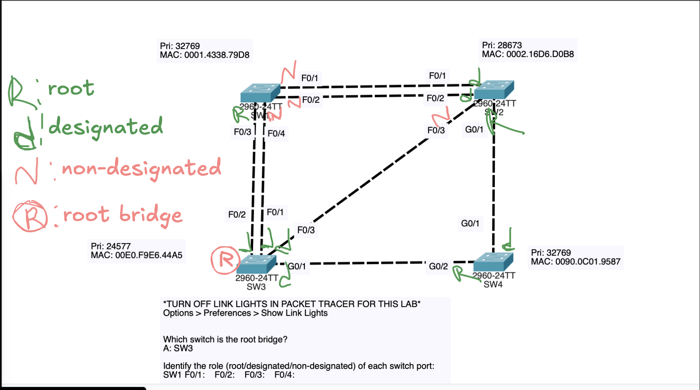
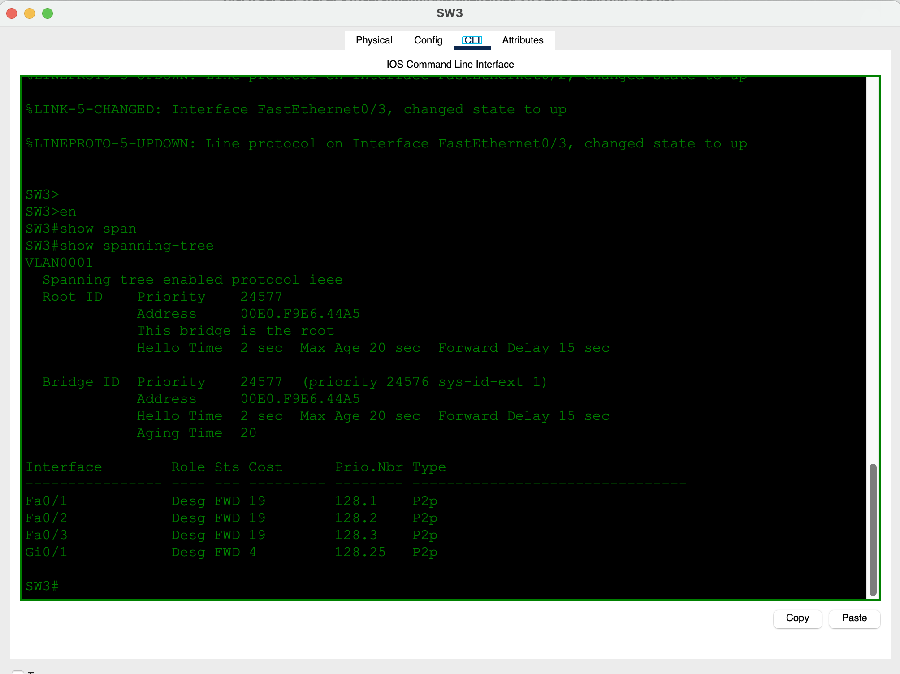
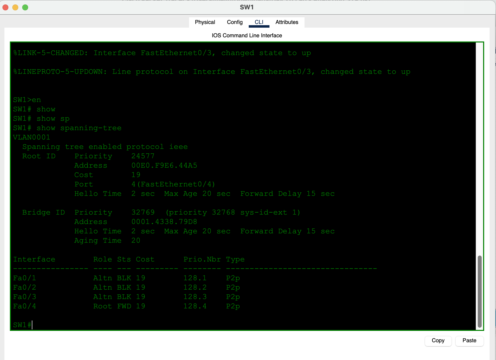
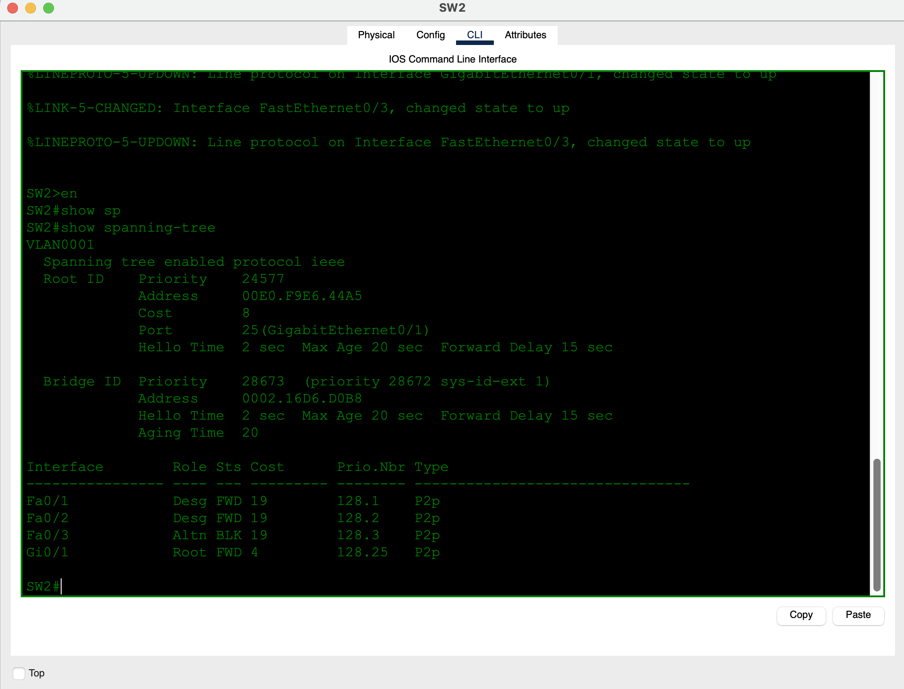
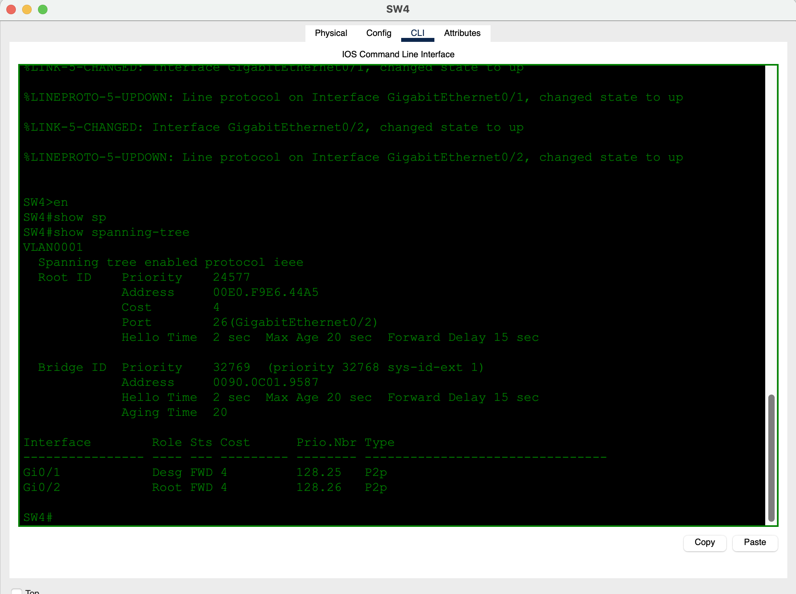

# Day 20 — Analyzing STP

**Topic:** Classic IEEE STP — root election, root / designated / alternate ports
**Simulator:** Cisco Packet Tracer — `Day 20 Lab - Analyzing STP.pkt`
**Course reference:** Jeremy's IT Lab — CCNA 200-301, Day 20 (Spanning Tree)

---

## 🎯 Objective

> Four switches, several parallel links, one VLAN. Turn **link lights off** in Packet Tracer (`Options → Preferences → Show Link Lights`) so the orange/green ports do not give the answer away. Use `show spanning-tree` to find the **root bridge** and label every port as **root (R)**, **designated (D)**, or **non-designated / alternate (N)**.

## 🗺️ Topology

Four 2960s in a looped square, plus extra FastEthernet parallels:

- **SW1** (top-left) — F0/1–F0/2 to SW2, F0/3–F0/4 to SW3
- **SW2** (top-right) — F0/1–F0/2 to SW1, F0/3 to SW3, G0/1 to SW4
- **SW3** (bottom-left) — F0/1–F0/2 to SW1, F0/3 to SW2, G0/1 to SW4
- **SW4** (bottom-right) — G0/1 to SW2, G0/2 to SW3

## 🧠 Lesson: how STP picks winners

Classic STP (`protocol ieee`) builds a loop-free tree:

1. **Root bridge** — lowest **Bridge ID** = priority + MAC. Default priority is `32768` plus the VLAN ID (`sys-id-ext`), so VLAN 1 shows as **32769**.
2. **Root port** (one per non-root switch) — lowest **cost** to the root. Tie: lowest neighbor BID, then lowest neighbor port ID.
3. **Designated port** (one per segment) — the end closest to the root forwards. The other end becomes **alternate / non-designated** and **blocks**.

IEEE costs used here: FastEthernet **19**, Gigabit **4**.

Timers on every switch: Hello **2 s**, Max Age **20 s**, Forward Delay **15 s**.

## 📐 Bridge IDs

| Switch | Priority (shown) | Base priority | MAC | Result |
|--------|-----------------:|--------------:|-----|--------|
| **SW3** | **24577** | 24576 | `00E0.F9E6.44A5` | **Root** — lowest priority |
| SW2 | 28673 | 28672 | `0002.16D6.D0B8` | Second |
| SW1 | 32769 | 32768 | `0001.4338.79D8` | Default |
| SW4 | 32769 | 32768 | `0090.0C01.9587` | Default |

SW3 prints `This bridge is the root`.

## 🛠️ Analysis (`show spanning-tree`)

### SW3 — root

Every port is **Desg FWD**. Cost 0 to itself. Gi0/1 costs **4**; the FastEthernet ports cost **19**.

### SW1 — three alternates, one root port

Root port **Fa0/4** (cost **19**) — the FastEthernet that faces SW3 F0/1. Fa0/3 also costs 19 to the root, but SW3’s F0/2 is a worse neighbor port ID than F0/1, so Fa0/3 is **Altn BLK**. Fa0/1 and Fa0/2 toward SW2 are also **Altn BLK** (path via SW2 is more expensive than 19).

### SW2 — Gigabit path to the root

Root port **Gi0/1** (cost **8**): SW2 → SW4 → SW3, two Gig hops (`4 + 4`). That beats Fa0/3 straight to SW3 (cost 19), so Fa0/3 is **Altn BLK**. Fa0/1 and Fa0/2 are **Desg FWD** toward SW1’s blocked ports.

### SW4 — one hop from the root

Root port **Gi0/2** (cost **4**) to SW3. Gi0/1 is **Desg FWD** — it is the designated end of the SW2–SW4 Gigabit link (SW2 uses that link as its root port).

## ✅ Port-role map

| Switch | Port | Role in `show spanning-tree` | Label |
|--------|------|------------------------------|-------|
| SW3 | Fa0/1, Fa0/2, Fa0/3, Gi0/1 | Desg FWD | D (root bridge) |
| SW1 | Fa0/4 | Root FWD | R |
| SW1 | Fa0/1, Fa0/2, Fa0/3 | Altn BLK | N |
| SW2 | Gi0/1 | Root FWD | R |
| SW2 | Fa0/1, Fa0/2 | Desg FWD | D |
| SW2 | Fa0/3 | Altn BLK | N |
| SW4 | Gi0/2 | Root FWD | R |
| SW4 | Gi0/1 | Desg FWD | D |

Lab questions:

- **Which switch is the root bridge?** SW3 (priority 24576 / BID 24577).
- **SW1 F0/1, F0/2, F0/3, F0/4?** N, N, N, R.

## 💡 What I learned

STP elects one root from Bridge ID, then every other switch picks a single root port by cost. Parallel FastEthernet links to the same neighbor are broken by **port ID**, not by guessing. A two-hop Gigabit path (cost 8) beats a one-hop FastEthernet path (cost 19) — that is why SW2’s root port is Gi0/1 through SW4 instead of Fa0/3 to SW3. Blocking ports are not dead; they are **alternates**, ready if the root port fails. `show spanning-tree` is the whole lab: Root ID, Bridge ID, then Role/Sts on each interface.

## 📎 Files in this lab

- `README.md` — this writeup
- `day20-analyzing-stp.pkt` — Packet Tracer save (`Day 20 Lab - Analyzing STP.pkt`)
- `day20-topology.png` — annotated topology (main photo)
- `day20-sw1-stp.png` … `day20-sw4-stp.png` — `show spanning-tree` on each switch
