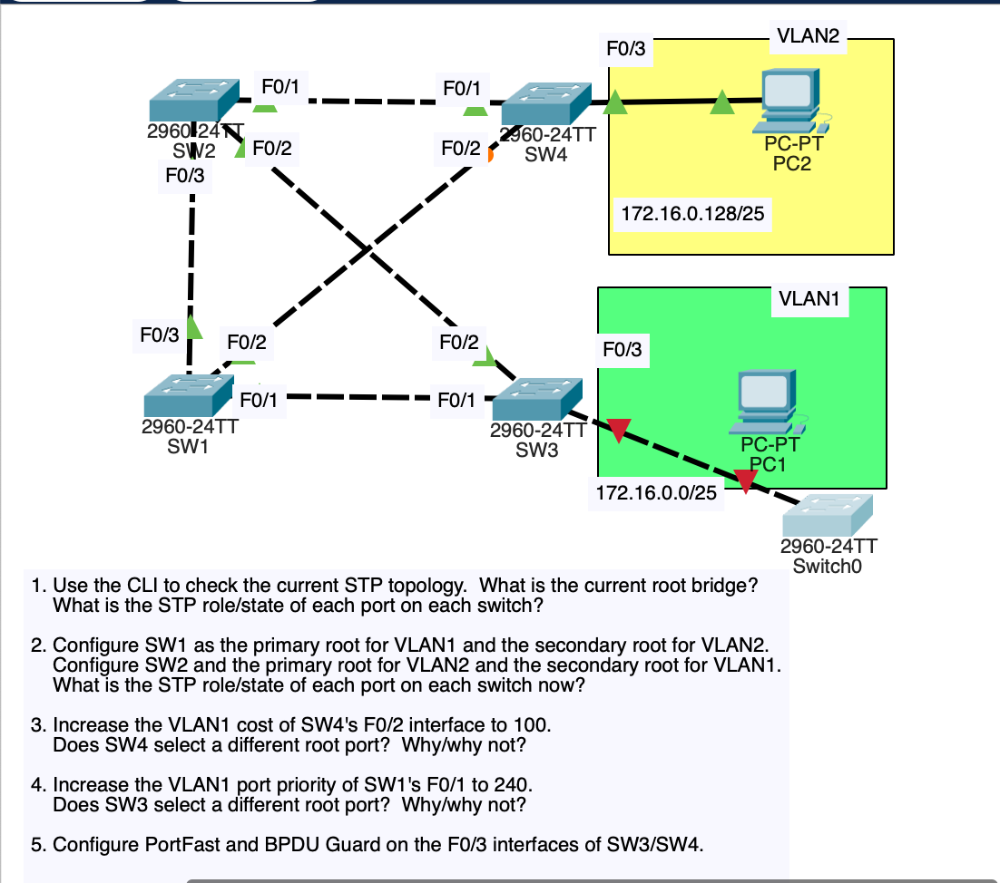
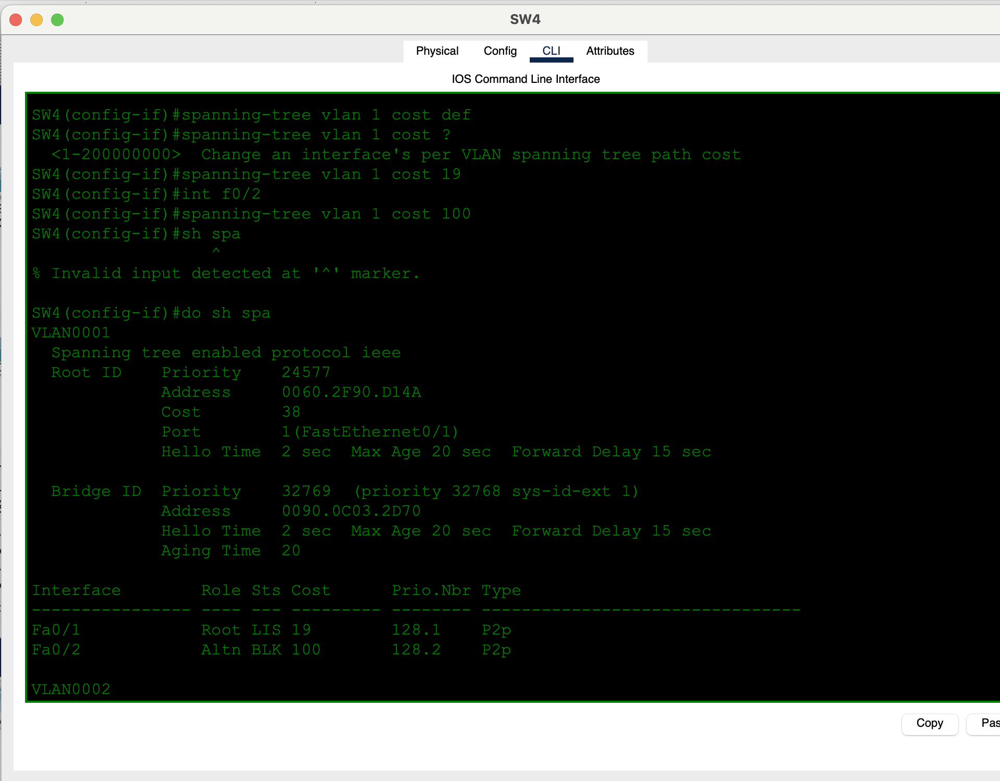
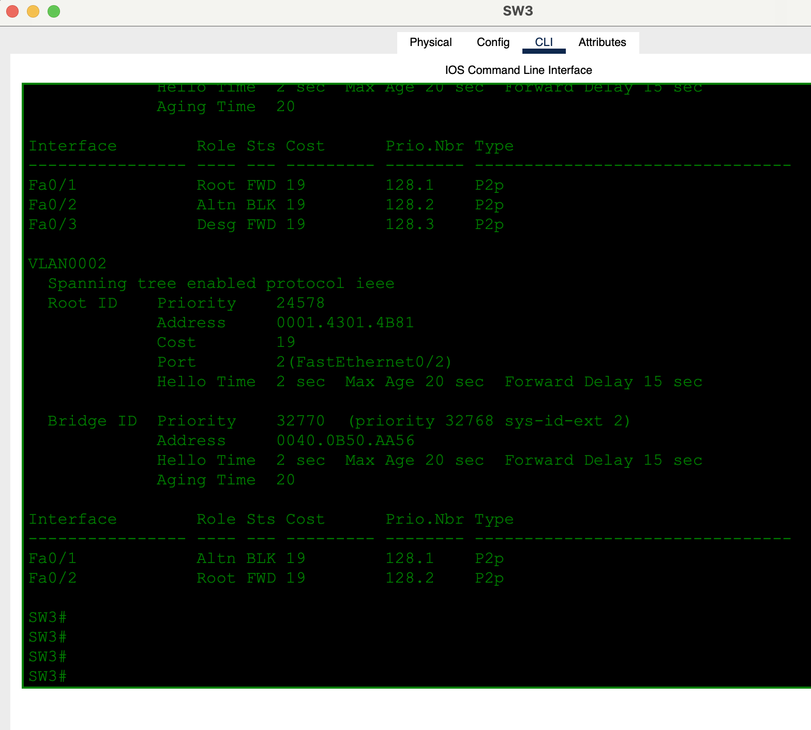
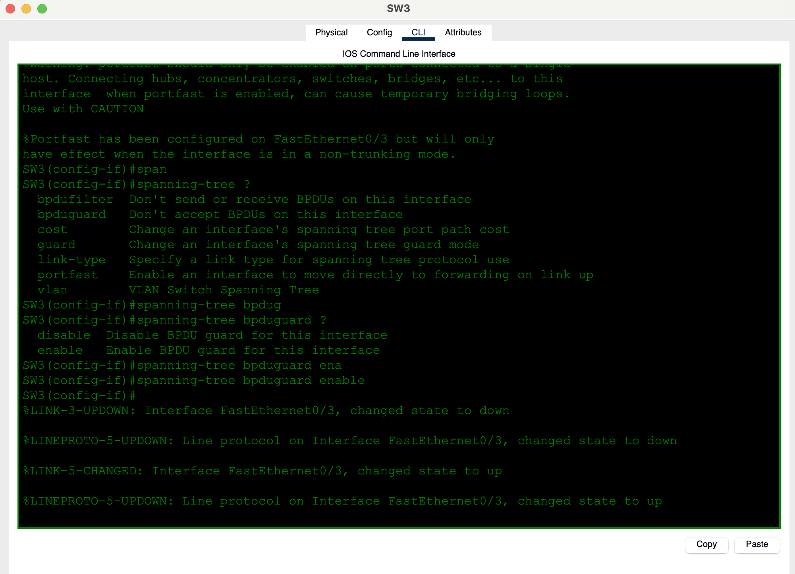
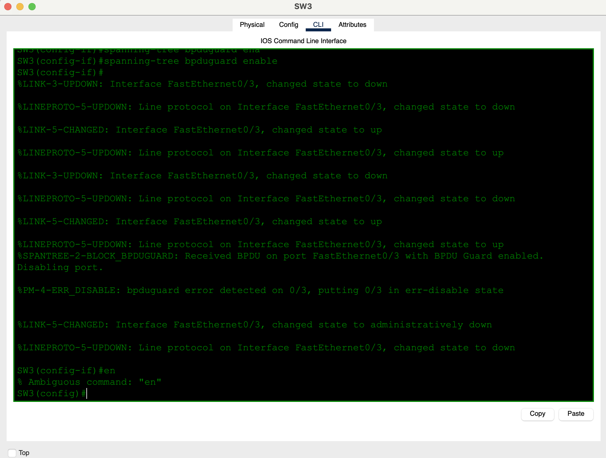
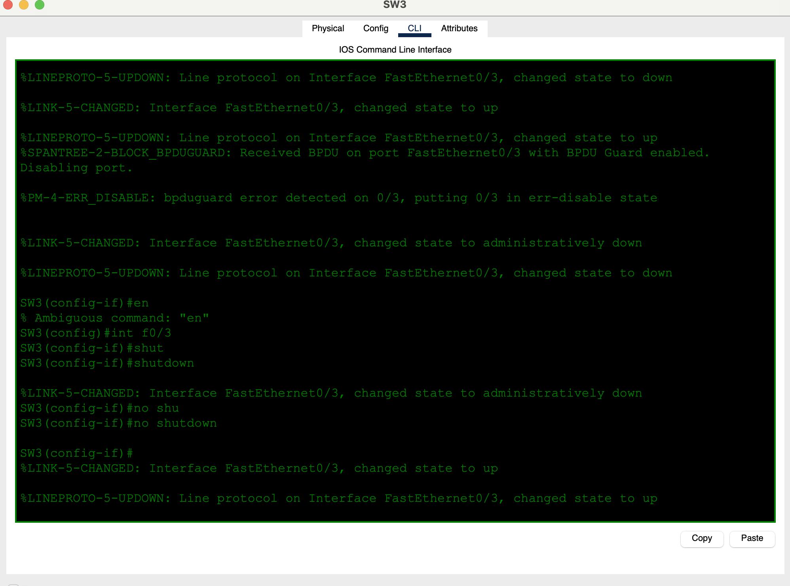

# Day 21 — Configuring Spanning Tree

**Topic:** PVST+ root primary/secondary, port cost, port priority, PortFast, BPDU Guard
**Simulator:** Cisco Packet Tracer — `Day 21 Lab - Configuring Spanning Tree.pkt`
**Course reference:** Jeremy's IT Lab — CCNA 200-301, Day 21 (Configuring STP)

---

## 🎯 Objective

> Day 20 was *read* STP. This lab *changes* it. Set per-VLAN roots, force a root-port change with **cost**, prove that **port priority** does not beat a better cost, then harden the PC access ports with **PortFast + BPDU Guard** — and recover when Guard err-disables a port that still hears BPDUs.

## 🗺️ Topology

Four 2960s, two VLANs, PCs on the edge:

- **VLAN 1** `172.16.0.0/25` — PC1 on SW3 F0/3
- **VLAN 2** `172.16.0.128/25` — PC2 on SW4 F0/3
- SW1 F0/1 ↔ SW3 F0/1 · SW1 F0/2 ↔ SW4 F0/2 · SW1 F0/3 ↔ SW2 F0/3
- SW2 F0/1 ↔ SW4 F0/1 · SW2 F0/2 ↔ SW3 F0/2



## 🧠 Lesson: what you can tune

| Knob | Command | When it matters |
|------|---------|-----------------|
| Root bridge | `spanning-tree vlan N root primary / secondary` | Sets priority 24576 / 28672 so *you* pick the root per VLAN |
| Port cost | `spanning-tree vlan N cost <1–200000000>` | Lowest cost wins root-port election |
| Port priority | `spanning-tree vlan N port-priority <0–240, step 16>` | Tiebreak only (neighbor port ID) |
| PortFast | `spanning-tree portfast` | Skip listen/learn on **edge** ports |
| BPDU Guard | `spanning-tree bpduguard enable` | Any BPDU → **err-disable** |

PVST+ runs **one tree per VLAN**. VLAN 1 and VLAN 2 can have different roots and different blocked ports.

## 🛠️ Configuration

### 1 — Inspect the starting tree

```
show spanning-tree
show spanning-tree vlan 1
show spanning-tree vlan 2
```

Default priorities are 32768 + VLAN (`32769` / `32770`). Whichever switch has the lowest BID is root until you change it.

### 2 — Per-VLAN roots

**SW1**
```
spanning-tree vlan 1 root primary
spanning-tree vlan 2 root secondary
```

**SW2**
```
spanning-tree vlan 2 root primary
spanning-tree vlan 1 root secondary
```

After this, VLAN 1 Root ID shows priority **24577** (24576 + 1) on SW1. VLAN 2 shows **24578** (24576 + 2) on SW2.

### 3 — Raise SW4 F0/2 cost (VLAN 1) to 1000

SW4 F0/2 is the **direct** FastEthernet to SW1 (VLAN 1 root), default cost 19. F0/1 goes SW4 → SW2 → SW1 (cost 38).

```
interface f0/2
 spanning-tree vlan 1 cost 1000
```

`show spanning-tree` on SW4: Fa0/1 **Root** (root-path cost **38**), Fa0/2 **Altn BLK** (port cost 1000). Mid-change Fa0/1 can sit in **LIS** for a forward-delay.

**Does SW4 pick a different root port? Yes.** 1000 > 38, so the two-hop path beats the now-expensive direct link.



### 4 — Raise SW1 F0/1 port priority to 240 (VLAN 1)

```
interface f0/1
 spanning-tree vlan 1 port-priority 240
```

SW3’s VLAN 1 root port is still **Fa0/1** (direct to SW1, cost 19). The other path is Fa0/2 → SW2 → SW1 (cost 38). Port priority is only a tiebreaker; **cost already decided**.

**Does SW3 pick a different root port? No.**



### 5 — PortFast + BPDU Guard on the PC ports

**SW3 F0/3 and SW4 F0/3**
```
interface f0/3
 spanning-tree portfast
 spanning-tree bpduguard enable
```

IOS warns: PortFast is for a **single host**, and it only applies in access mode.



On SW3, F0/3 immediately received a BPDU (another switch — Switch0 — on that edge port):

```
%SPANTREE-2-BLOCK_BPDUGUARD: Received BPDU on port FastEthernet0/3
%PM-4-ERR_DISABLE: bpduguard error detected on 0/3
```

That is Guard doing its job. Bounce the port after the rogue switch is gone:

```
interface f0/3
 shutdown
 no shutdown
```





## ✅ Verification

| Check | Expected |
|-------|----------|
| SW1 `show spanning-tree vlan 1` | `This bridge is the root`, priority 24577 |
| SW2 `show spanning-tree vlan 2` | `This bridge is the root`, priority 24578 |
| SW4 VLAN 1 after cost 1000 | Root port **Fa0/1**, Fa0/2 Altn cost 1000 |
| SW3 VLAN 1 after port-priority 240 | Root port still **Fa0/1** |
| SW3 VLAN 2 | Root port **Fa0/2** (toward SW2) |
| Edge F0/3 | PortFast + BPDU Guard; err-disable if a BPDU arrives |

## 💡 What I learned

`root primary` / `root secondary` is how you place the tree per VLAN instead of leaving it to MAC addresses. **Cost** is the lever that actually moves a root port; **port priority** only matters when two paths are tied. PortFast is safe on a PC port and dangerous on a switch-to-switch link. BPDU Guard makes that concrete: one unexpected BPDU and the port is err-disabled until you `shutdown` / `no shutdown` (and remove the extra switch).

## 📎 Files in this lab

- `README.md` — this writeup
- `day21-configuring-stp.pkt` — Packet Tracer save
- `day21-topology.png` — topology + tasks (main photo)
- `day21-q3-sw4-cost.png` — SW4 cost change
- `day21-q4-sw3-priority.png` — SW3 after port-priority
- `day21-q5-portfast.png`, `day21-q5-errdisable.png`, `day21-q5-recovery.png` — PortFast / BPDU Guard
