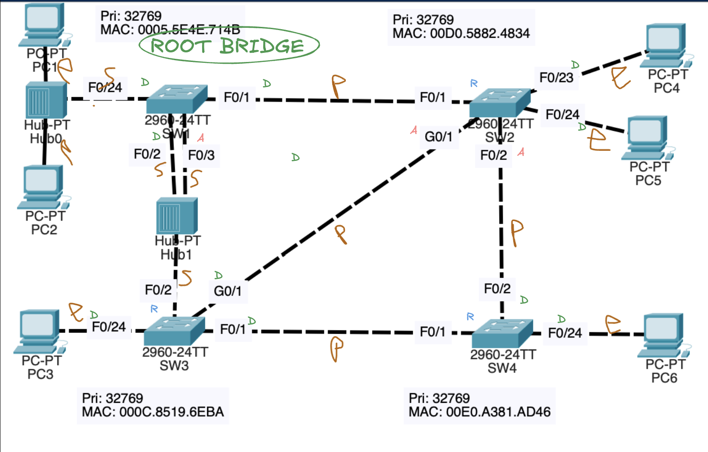
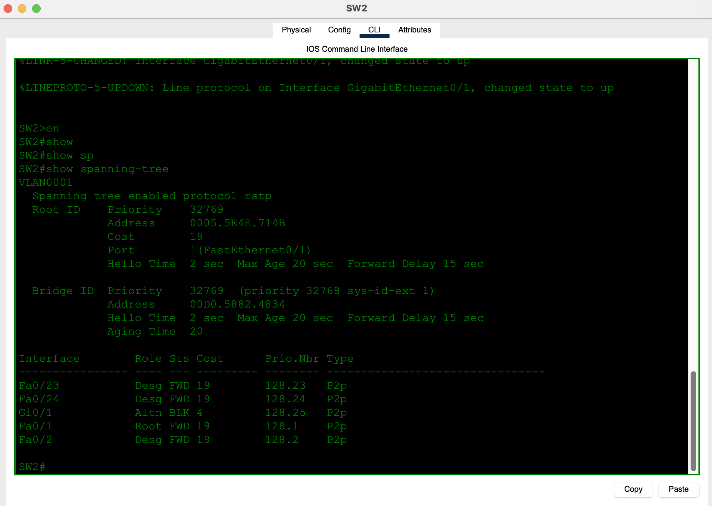
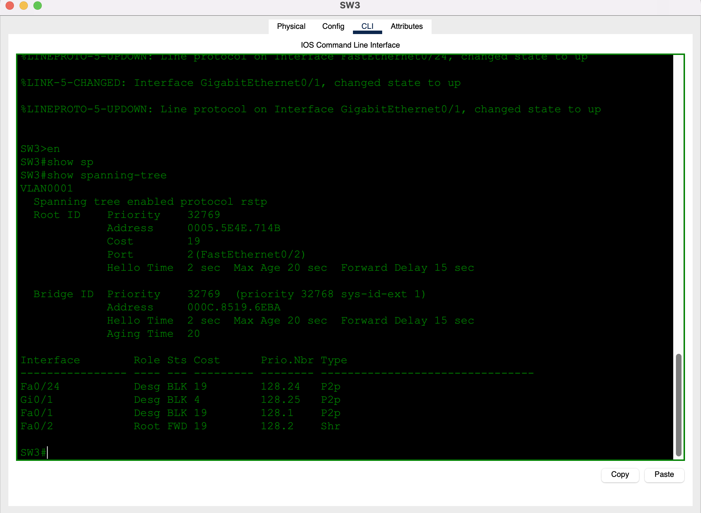
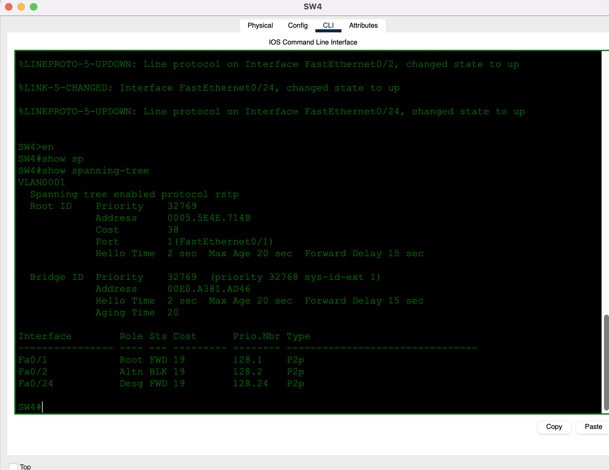
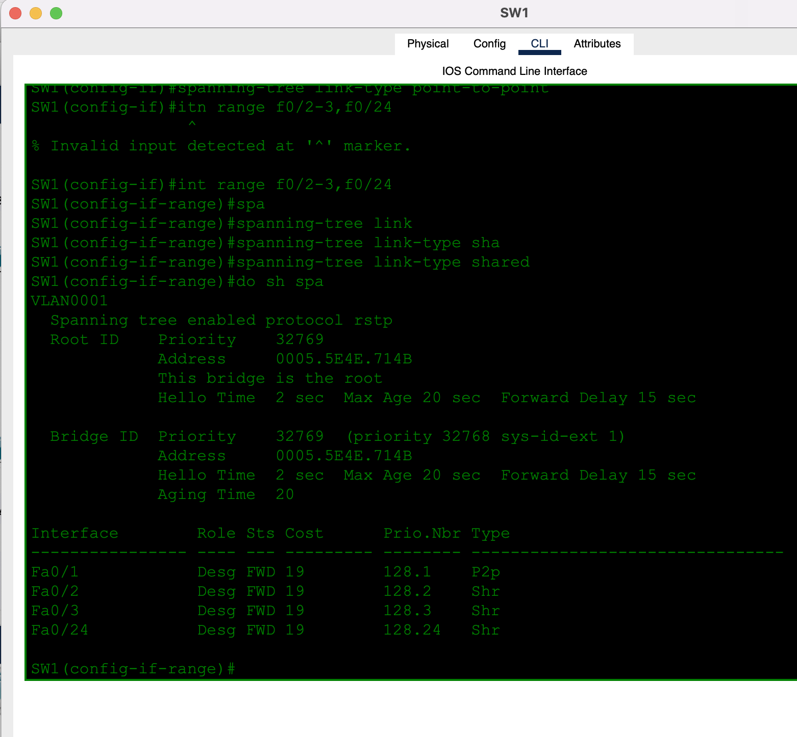
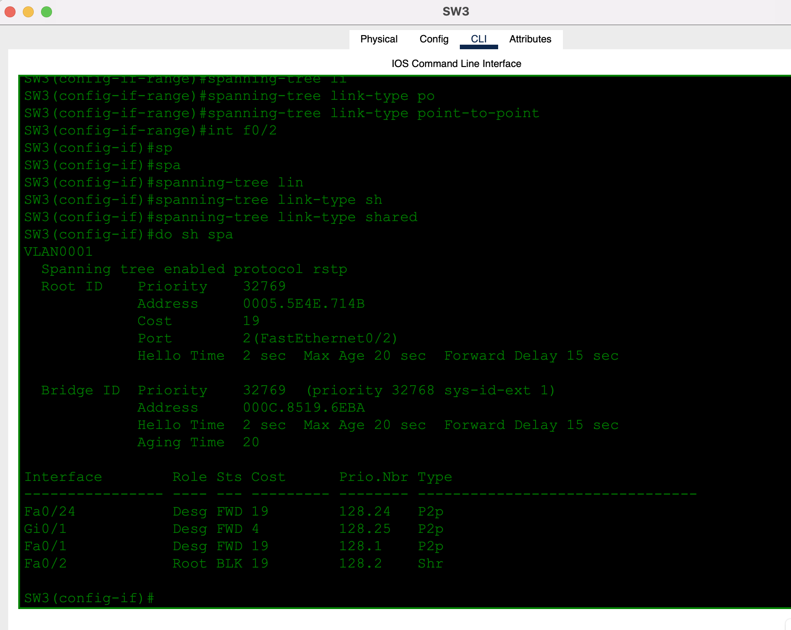
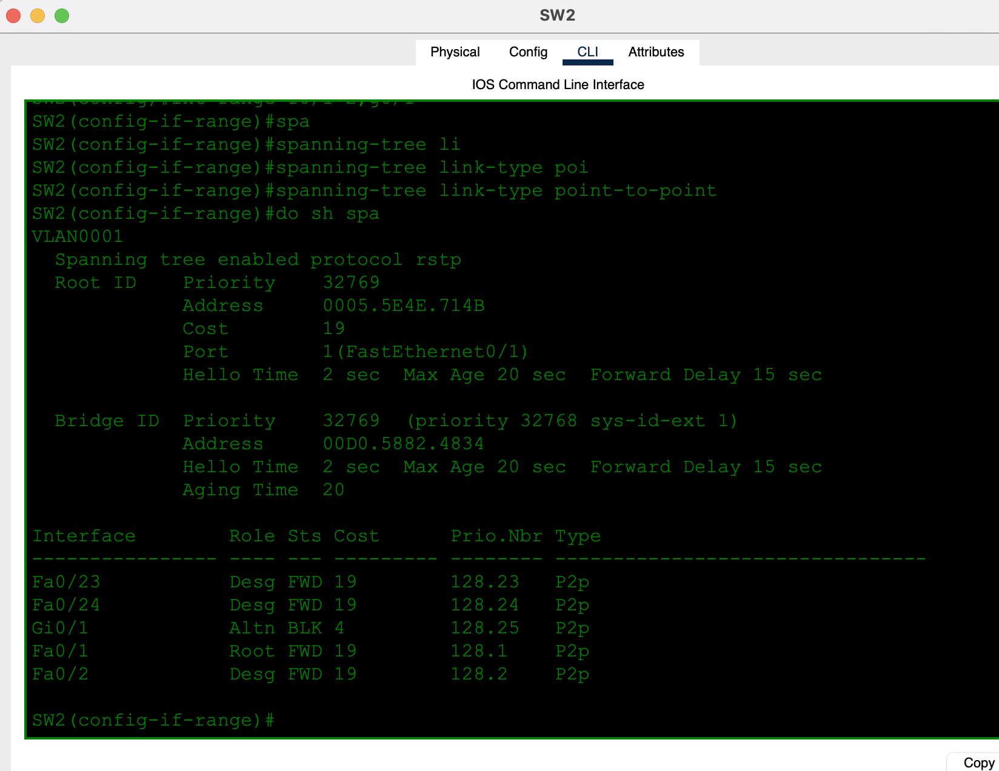
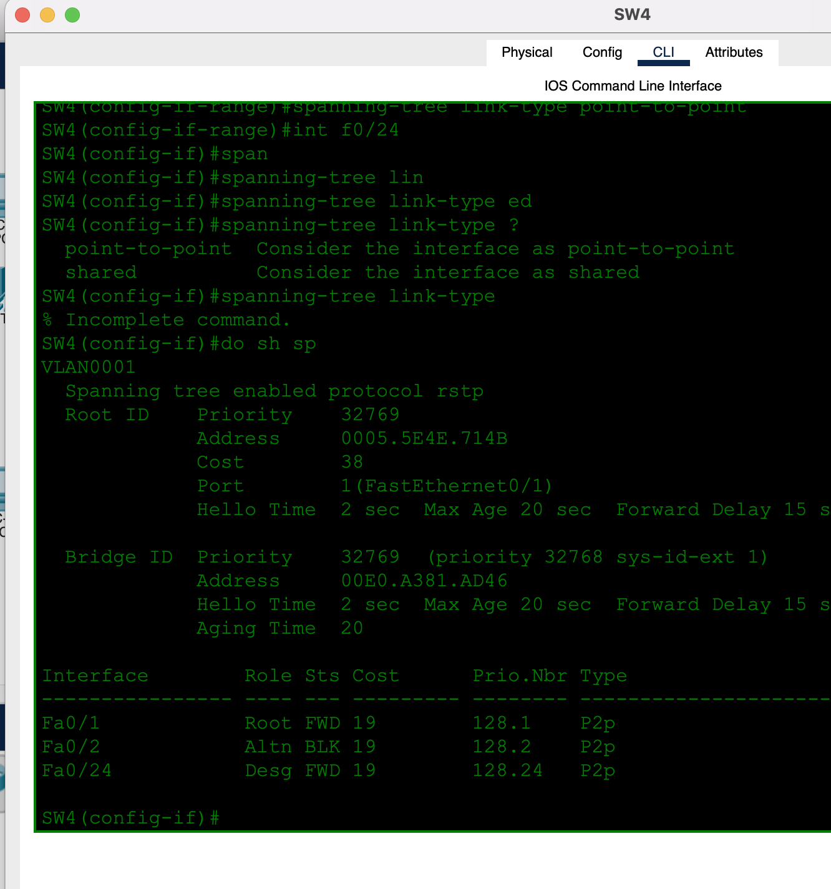

# Day 22 — Rapid STP

**Topic:** RSTP (802.1w) — roles, edge / point-to-point / shared link types
**Simulator:** Cisco Packet Tracer — `Day 22 Lab - Rapid STP.pkt`
**Course reference:** Jeremy's IT Lab — CCNA 200-301, Day 22 (Rapid PVST+)

---

## 🎯 Objective

> Same idea as Day 20 (find the root, label every port) but the protocol is **`rstp`**, and the new question is **link type**. Point-to-point switch links can handshake instantly. Ports behind a **hub** are **shared** and fall back to timer-based STP. Edge ports face PCs.

## 🗺️ Topology

Four 2960s, two hubs, PCs on the edge. All switch priorities are the default **32769**; **SW1** wins root on MAC `0005.5E4E.714B`.

- **SW1** — F0/1 to SW2 (P2p); F0/2–F0/3 and F0/24 into **Hub1 / Hub0** (shared)
- **SW2** — F0/1 to SW1 (root); F0/2 to SW4; G0/1 to SW3 (alternate); F0/23–24 to PC4/PC5
- **SW3** — F0/2 through Hub1 to SW1 (root, shared); F0/1 to SW4; G0/1 to SW2; F0/24 to PC3
- **SW4** — F0/1 to SW3 (root); F0/2 to SW2 (alternate); F0/24 to PC6



Annotation: **R** root · **D** designated · **A** alternate · **E** edge · **P** point-to-point · **S** shared.

## 🧠 Lesson: RSTP vs classic STP

`show spanning-tree` now says `protocol rstp`. Roles you already know (Root / Desg / Altn) are still there. What is new is the **Type** column:

| Type | Meaning | Rapid handshake? |
|------|---------|------------------|
| **P2p** | Full-duplex, one neighbor (switch–switch) | Yes — proposal/agreement |
| **Shr** | Half-duplex / hub (shared segment) | No — old listen/learn timers |
| **Edge** (PortFast) | Host only | Forwards immediately; not used as a switch link |

RSTP states are **Discarding / Learning / Forwarding** (no Listening). Alternate ports are Discarding backups toward the root.

A designated port stuck in **BLK** next to a **shared root port** is RSTP refusing to go rapid on that side until the shared segment is classified correctly (or until timers expire).

## 📐 Root and first `show spanning-tree`

SW1: `This bridge is the root`. Lowest MAC, same priority as everyone else.








| Switch | Port | Role / state | Type |
|--------|------|--------------|------|
| SW1 | Fa0/1 | Desg FWD | P2p |
| SW1 | Fa0/2, Fa0/3, Fa0/24 | Desg FWD | Shr |
| SW2 | Fa0/1 | Root FWD | P2p |
| SW2 | G0/1 | Altn BLK | P2p |
| SW2 | Fa0/2, Fa0/23, Fa0/24 | Desg FWD | P2p |
| SW3 | Fa0/2 | Root FWD | Shr |
| SW3 | Fa0/1, G0/1, Fa0/24 | Desg BLK (pre–link-type) | P2p |
| SW4 | Fa0/1 | Root FWD | P2p |
| SW4 | Fa0/2 | Altn BLK | P2p |
| SW4 | Fa0/24 | Desg FWD | P2p |

SW2’s Gigabit to SW3 is **alternate** because the FastEthernet to SW1 is a cheaper path to the root (cost 19 vs 19+4).

## 🛠️ Configuration — force the link type

IOS guesses P2p from full duplex and Shr from half duplex. Hubs and some Packet Tracer links need an explicit type.

```
spanning-tree mode rapid-pvst
```

**Hub / shared ports (SW1 F0/2–3, F0/24; SW3 F0/2)**
```
interface range f0/2 - 3 , f0/24
 spanning-tree link-type shared
```

**Switch–switch full duplex**
```
interface range f0/1 , g0/1
 spanning-tree link-type point-to-point
```

`interface range` syntax is `f0/2-3,f0/24` (comma, no extra words). `it range` is invalid.

**PC access ports** (same idea as Day 21):
```
interface f0/24
 spanning-tree portfast
 spanning-tree bpduguard enable
```

After the shared/P2p statements, SW3’s designated ports move to **FWD**; the hub uplink stays **Shr**.









## ✅ Verification

| Check | Expected |
|-------|----------|
| `show spanning-tree` | `protocol rstp` |
| SW1 | Root; hub ports **Shr**; F0/1 **P2p** |
| SW2 | Root port F0/1; G0/1 **Altn BLK** |
| SW3 | Root port F0/2 **Shr**; remaining ports **P2p** and FWD after link-type |
| SW4 | Root port F0/1 (cost 38); F0/2 alternate |
| Type column | P2p on switch–switch, Shr on hubs, edge/PortFast on PCs |

## 💡 What I learned

RSTP is still “one root, one root port, block the rest,” but it only goes *rapid* on **point-to-point** links. A hub makes the segment **shared**, so that root port cannot use proposal/agreement and downstream designated ports can sit in discarding until you mark the link type (or wait for timers). Alternate is the RSTP name for the old non-designated backup. Edge/PortFast is still how PCs skip the handshake entirely.

## 📎 Files in this lab

- `README.md` — this writeup
- `day22-rapid-stp.pkt` — Packet Tracer save (`Day 22 Lab - Rapid STP.pkt`)
- `day22-topology.png` — annotated topology (main photo)
- `day22-sw1-rstp.png` … `day22-sw4-rstp.png` — first `show spanning-tree`
- `day22-sw1-linktype.png` … `day22-sw4-linktype.png` — after `link-type` config
