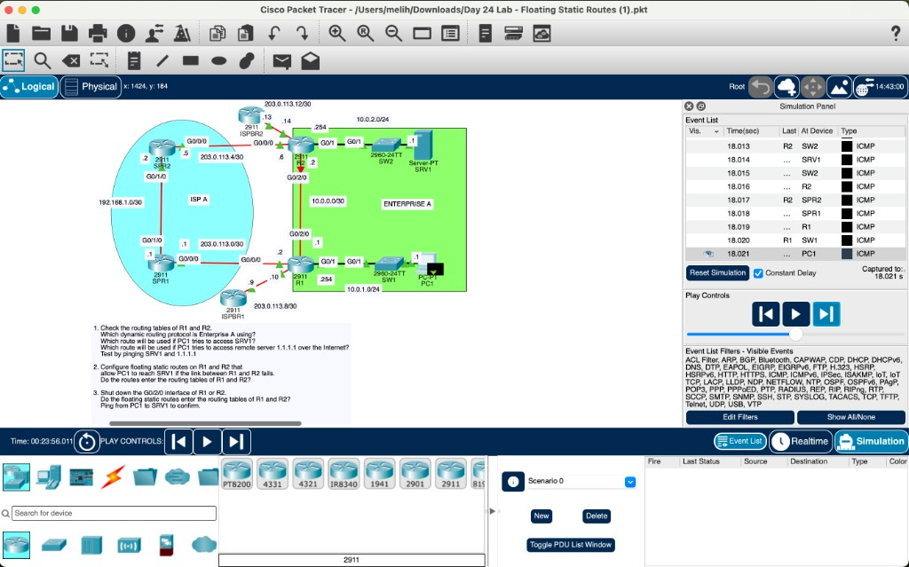
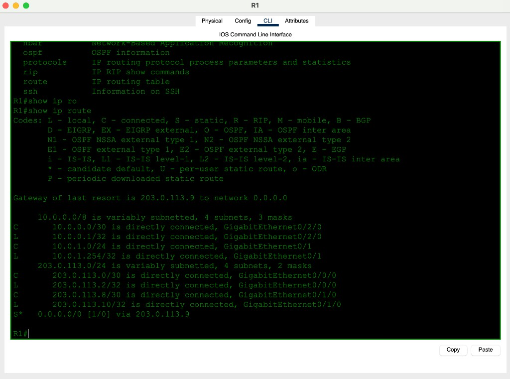
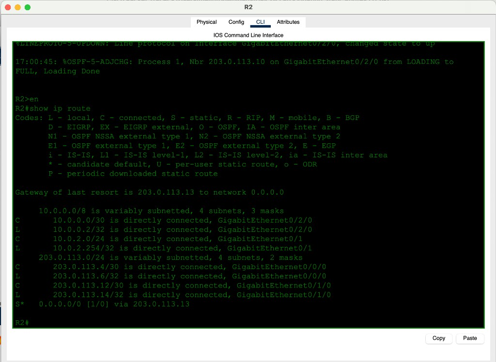
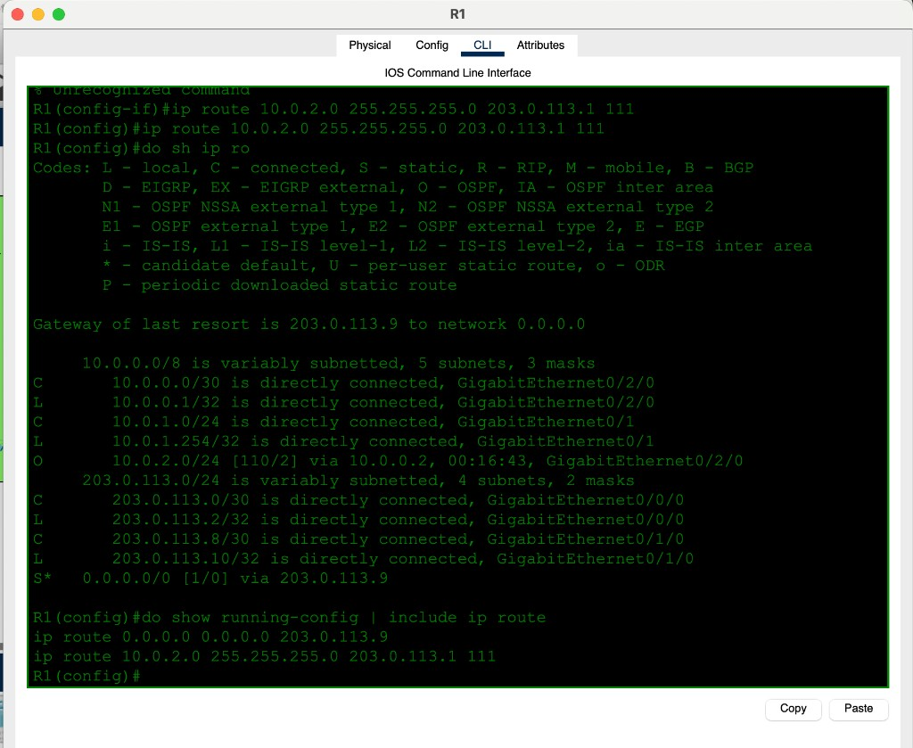
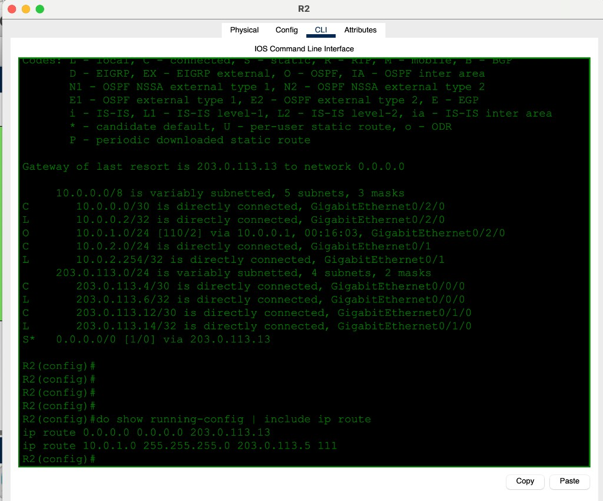
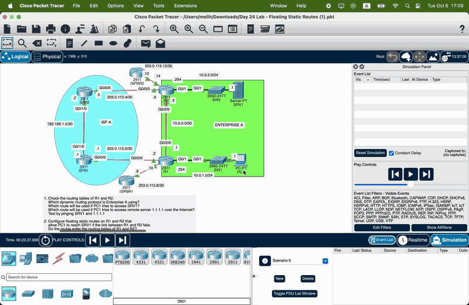

# Day 24 — Floating Static Routes

**Topic:** OSPF primary path vs floating static backup (AD 111) through the ISP
**Simulator:** Cisco Packet Tracer — `Day 24 Lab - Floating Static Routes.pkt`
**Course reference:** Jeremy's IT Lab — CCNA 200-301, Day 24 (floating statics)

---

## 🎯 Objective

> Enterprise A already has **OSPF** between R1 and R2 on `10.0.0.0/30`. That is how PC1 reaches SRV1. A **floating static** (higher administrative distance) sits in the config but **not** in the routing table until that link dies. Then the backup path through ISP A is used.

## 🗺️ Topology

Two sites in Enterprise A, two ISP routers, one Internet cloud.

| Device | LAN / role | Key IPs |
|--------|------------|---------|
| R1 | `10.0.1.0/24` gateway `.254` | G0/2/0 `.1` on `10.0.0.0/30` · G0/0/0 `.2` toward ISPR1 · G0/1/0 `.10` toward ISPR2 |
| R2 | `10.0.2.0/24` gateway `.254` | G0/2/0 `.2` · G0/0/0 `.6` toward ISPR2 · G0/1/0 `.14` toward ISPR1 |
| PC1 | `10.0.1.1` | via SW1 |
| SRV1 | `10.0.2.1` | via SW2 |
| ISPR1 / ISPR2 | ISP A | `192.168.1.0/30` between them |



## 🧠 Lesson: “floating” means worse AD

IOS installs **one** route per prefix: lowest **administrative distance** wins. OSPF is **110**. A static with AD **111** is configured but ignored until OSPF (and the connected `/30`) disappear.

```
ip route 10.0.2.0 255.255.255.0 203.0.113.1 111
```

The last number is the AD. Omit it and the static is AD **1**, which would **steal** the path from OSPF even while the internal link is up.

| Code | Source | AD (default) |
|------|--------|----------------|
| C | connected | 0 |
| S | static | 1 |
| O | OSPF | 110 |
| S (floating) | static with extra AD | 111 here |

## 1 — What is already there?

R1 starts with connected LANs plus a default static toward the Internet. OSPF process 1 then goes **FULL** on G0/2/0.





**Q: Which IGP is Enterprise A using?** OSPF (`O`, AD 110, process 1).

**Q: Which route does PC1 use to reach SRV1?** R1’s **OSPF** route `10.0.2.0/24 [110/2] via 10.0.0.2, GigabitEthernet0/2/0`.

**Q: Which route to `1.1.1.1`?** R1’s **default** `S* 0.0.0.0/0 [1/0] via 203.0.113.9` (G0/1/0 toward ISPR2).

Pings from PC1: `10.0.2.1` 4/4; `1.1.1.1` 3/4 (first packet often ARP).

## 2 — Floating statics (they stay out of the table)

```
! R1 — backup to the server LAN via ISPR1
ip route 10.0.2.0 255.255.255.0 203.0.113.1 111

! R2 — backup to the PC LAN via ISPR2
ip route 10.0.1.0 255.255.255.0 203.0.113.5 111
```

`255.255.255.255.0` is not a mask. Next hops are the **ISP** ends of each edge `/30` (`203.0.113.1` on ISPR1, `203.0.113.5` on ISPR2).





`show running-config | include ip route` shows both the default and the floating static. `show ip route` does **not** list the floating one — OSPF 110 beats 111.

## 3 — Shut G0/2/0; the backup installs

```
interface g0/2/0
 shutdown
```

OSPF adjacency drops (`FULL to DOWN`). The `/30` connected route is gone, so the `O` LAN prefix is gone. The AD 111 static **enters** the table.

![R1 — S 10.0.2.0/24 [111/0] via 203.0.113.1](day24-r1-failover.png)

![R2 — S 10.0.1.0/24 [111/0] via 203.0.113.5](day24-r2-failover.png)

PC1 → SRV1 now: PC1 → SW1 → R1 → **ISPR1 → ISPR2** → R2 → SW2 → SRV1.



## ✅ Verification

| Check | Expected |
|-------|----------|
| `show ip route` (link up) | `O 10.0.2.0/24 [110/2]` on R1; floating static **absent** |
| `show run \| include ip route` | default AD 1 **and** LAN static AD **111** |
| PC1 ping `10.0.2.1` / `1.1.1.1` | success (Internet may drop the first echo) |
| After `shutdown` G0/2/0 | `S 10.0.2.0/24 [111/0]` on R1; `S 10.0.1.0/24 [111/0]` on R2 |
| Simulation | ICMP crosses ISP A, not the red `10.0.0.0/30` link |

## 💡 What I learned

A floating static is just a static with an AD **worse** than the IGP. While OSPF owns `10.0.2.0/24`, the backup is config-only. Kill the internal link and IOS installs the ISP path automatically — no redistribution required. AD 1 would be a mistake here: that static would always win. The default route (`S*`) is a separate prefix; it does not backup the server LAN.

## 📎 Files in this lab

- `README.md` — this writeup
- `day24-floating-static.pkt` — Packet Tracer save
- `day24-topology.png` — topology + tasks (main photo)
- `day24-failover.gif` — pings + Simulation Mode through ISP A
- `day24-r1-connected.png` / `day24-r2-adj.png` — Q1 tables
- `day24-r1-floating-cfg.png` / `day24-r2-floating-cfg.png` — OSPF still preferred
- `day24-r1-failover.png` / `day24-r2-failover.png` — AD 111 in the table
