# Day 26 — OSPF (Part 1)

**Topic:** Single-area OSPFv2, loopbacks, passive interfaces, ASBR default (`O*E2`)
**Simulator:** Cisco Packet Tracer — `Day 26 Lab - OSPF (Part 1).pkt`
**Course reference:** Jeremy's IT Lab — CCNA 200-301, Day 26 (OSPF Part 1)

---

## 🎯 Objective

> Address the square of routers, put a **/32 loopback** on each, run **OSPF area 0** on every internal interface (not R1’s Internet link), make loopbacks and the PC LAN **passive**, then have R1 **originate a default** into OSPF. R2/R3/R4 should learn `O*E2 0.0.0.0/0`.

## 🗺️ Topology

Four routers in **OSPF area 0**, one LAN, one ISP uplink (not in OSPF).

| Link | Network | Addresses |
|------|---------|-----------|
| R1 G0/0 ↔ R2 G0/0 | `10.0.12.0/30` | `.1` / `.2` |
| R1 F1/0 ↔ R3 F1/0 | `10.0.13.0/30` | `.1` / `.2` |
| R2 F1/0 ↔ R4 F1/0 | `10.0.24.0/30` | `.1` / `.2` |
| R3 F2/0 ↔ R4 F2/0 | `10.0.34.0/30` | `.1` / `.2` |
| R4 G0/0 ↔ SW1 / PC1 | `192.168.4.0/24` | R4 `.254`, PC1 `.1` |
| R1 G3/0 ↔ ISPR1 | `203.0.113.0/30` | R1 `.1`, ISPR1 `.2` |
| Loopbacks | `/32` | R1 `1.1.1.1` · R2 `2.2.2.2` · R3 `3.3.3.3` · R4 `4.4.4.4` |

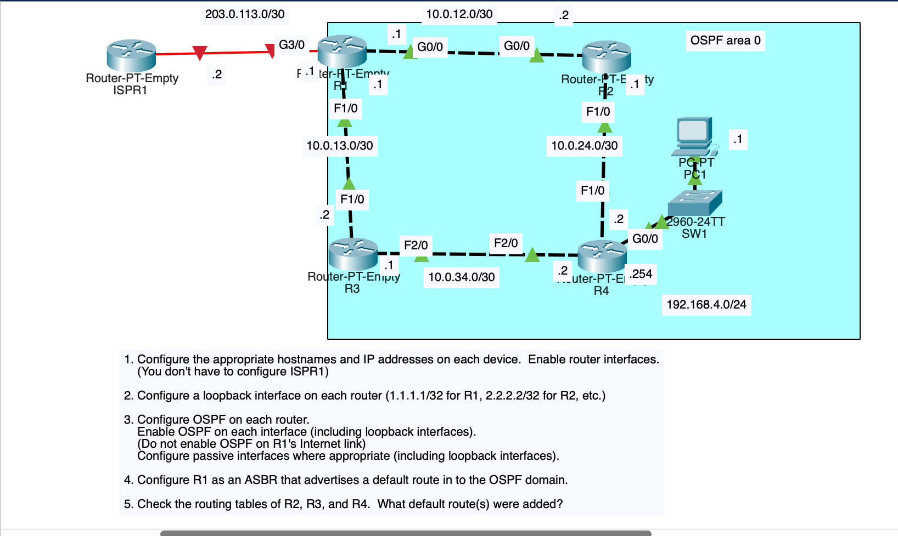

Do **not** configure ISPR1. Do **not** enable OSPF on R1 G3/0.

## 🧠 Lesson

OSPF floods **LSAs**; each router runs SPF and installs **O** routes (AD **110**). This lab is one area (**area 0**).

**Passive** = advertise the subnet, do **not** send hellos (loopbacks, PC LAN). Neighbors only form on router–router links.

R1 is an **ASBR**: it has a default toward the ISP and `default-information originate`. Internal routers install that as **`O*E2`** (OSPF external type 2, candidate default). E2 metric **does not grow** across the domain, so R4 can see **two** defaults at `[110/1]`.

A `/30` host cannot be the **network** address: `10.0.13.0/30` is illegal on the interface — use `.1`.

## 1 — IPs and hostnames

```
hostname R1
interface g0/0
 ip address 10.0.12.1 255.255.255.252
 no shutdown
interface f1/0
 ip address 10.0.13.1 255.255.255.252
 no shutdown
```

Same idea on R2–R4. R4 LAN:

```
interface g0/0
 ip address 192.168.4.254 255.255.255.0
 description ## to SW1 ##
 no shutdown
```

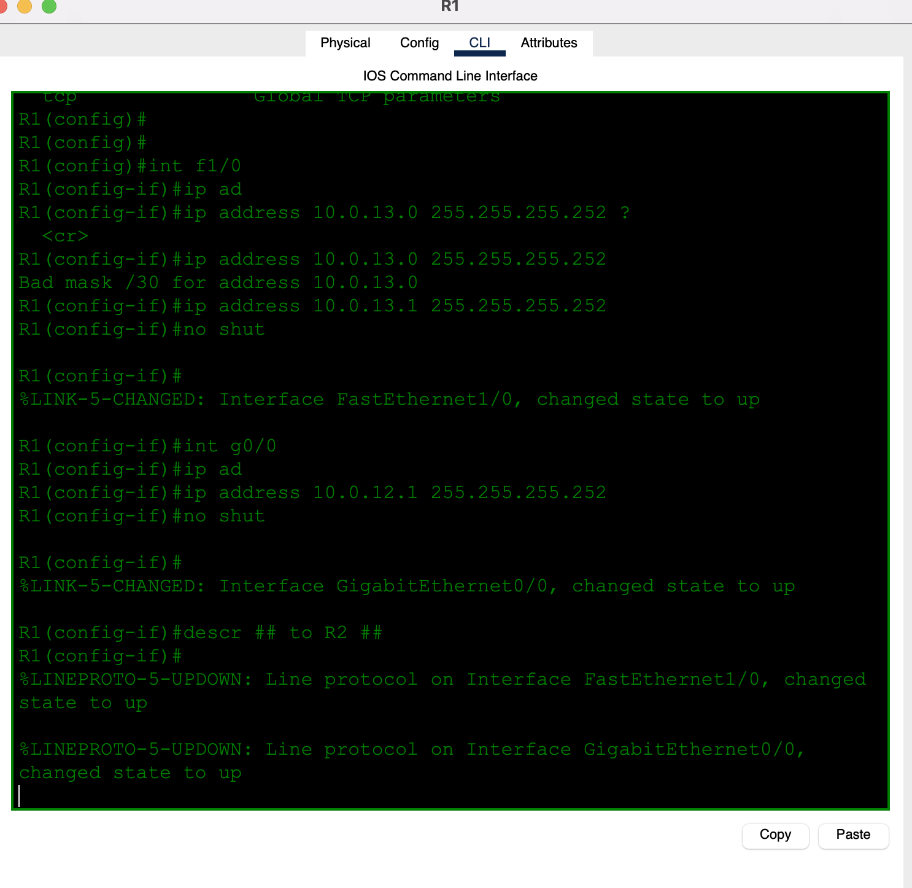

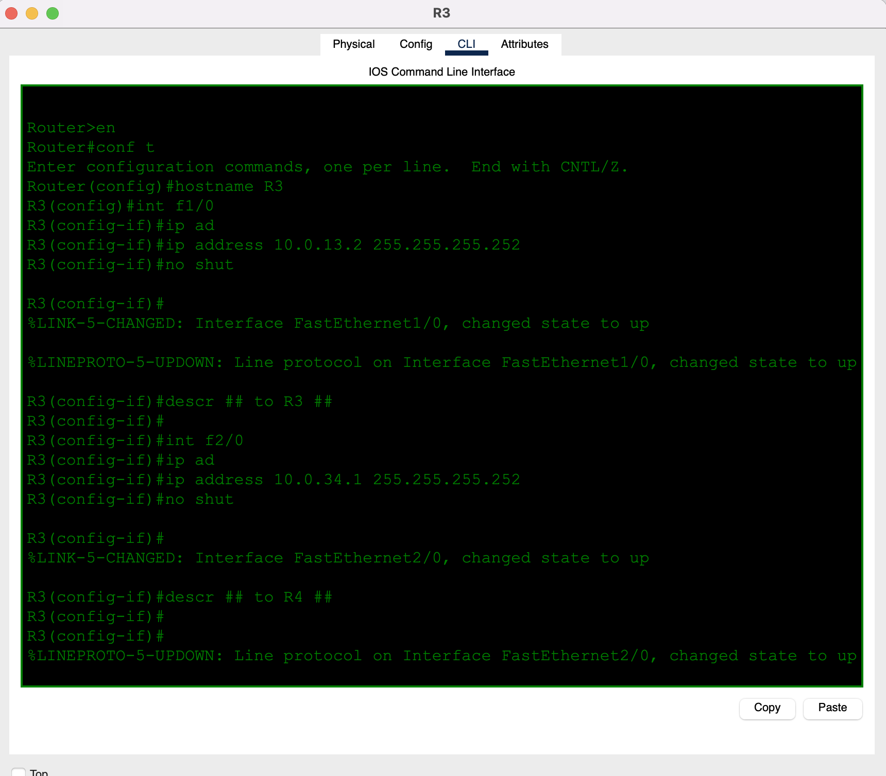

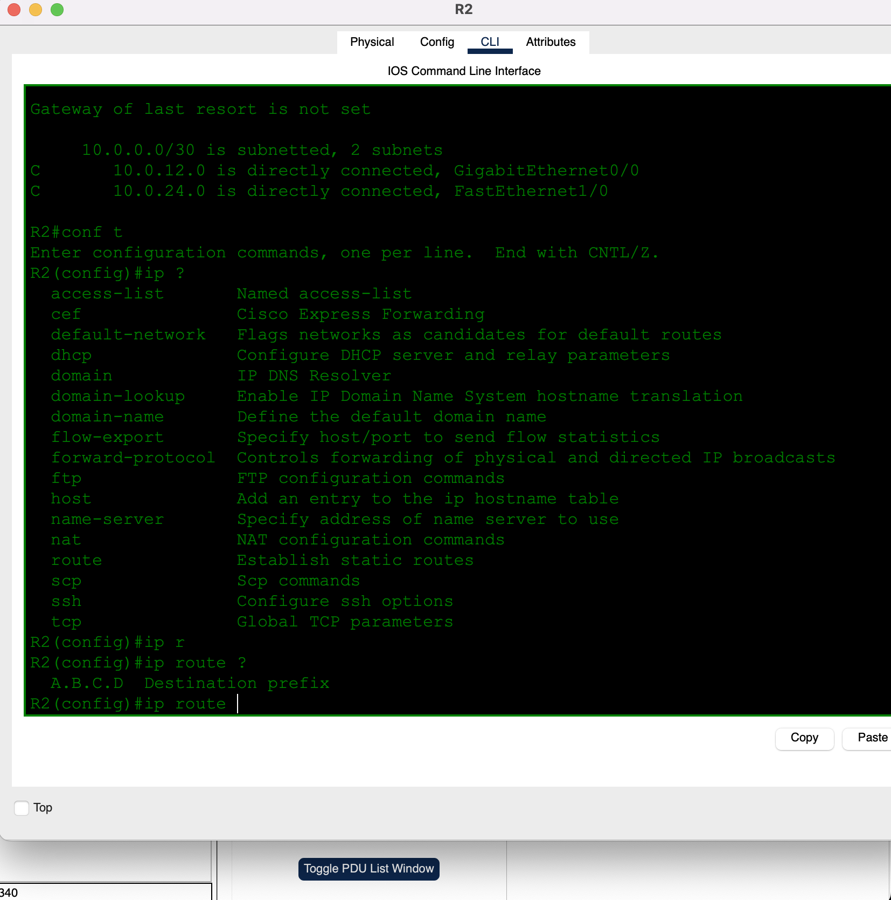

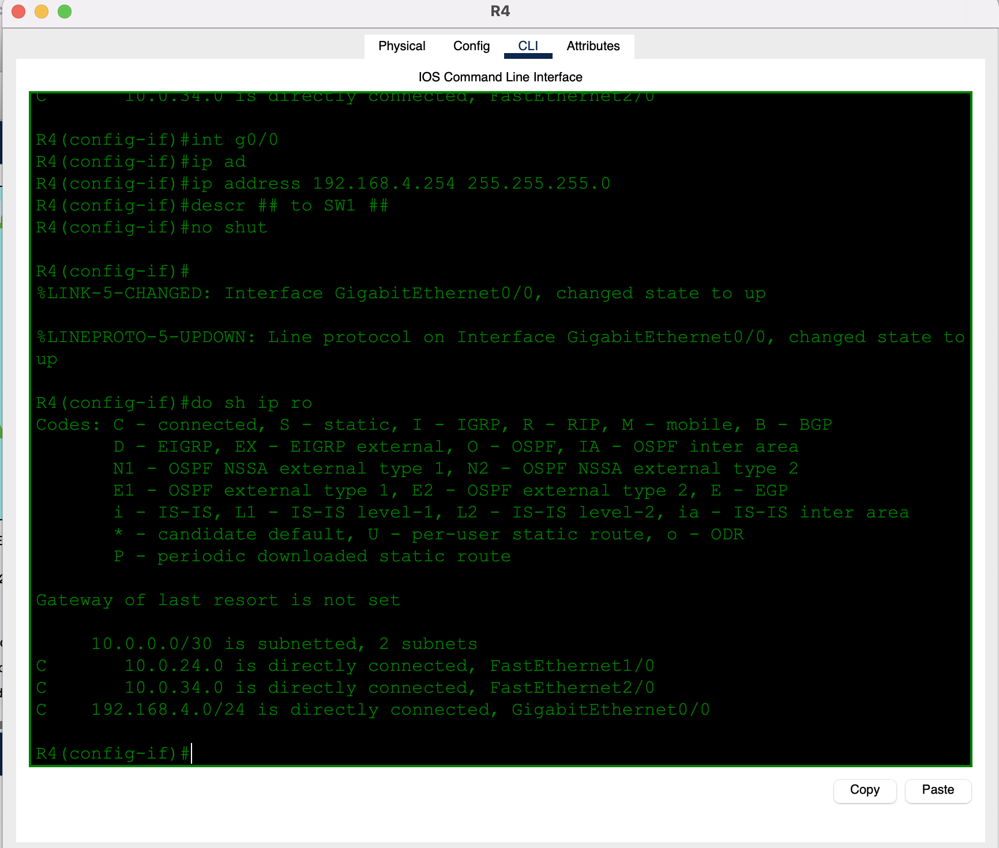

## 2 — Loopbacks

```
interface loopback 0
 ip address 1.1.1.1 255.255.255.255
```

(`2.2.2.2`, `3.3.3.3`, `4.4.4.4` on R2–R4.) `/32` is the usual RID source and a stub network.

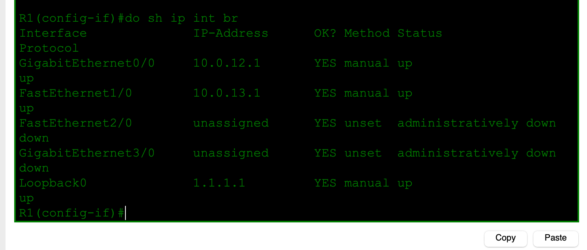

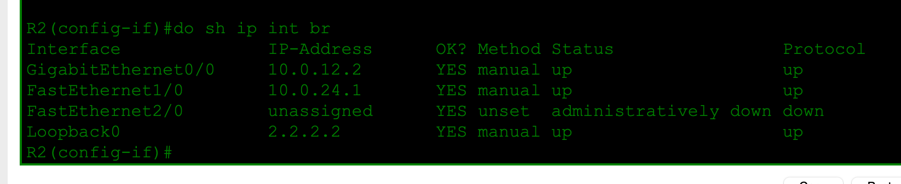

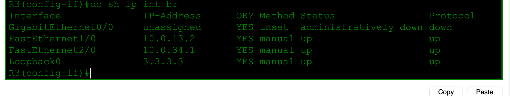

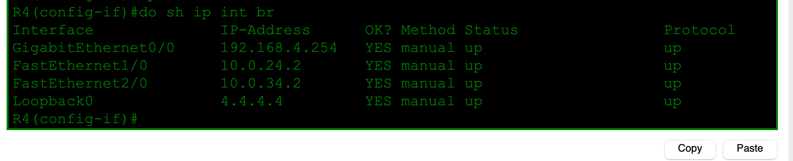

## 3 — OSPF area 0 (skip the Internet link)

```
router ospf 1
 router-id 1.1.1.1
 network 10.0.12.0 0.0.0.3 area 0
 network 10.0.13.0 0.0.0.3 area 0
 network 1.1.1.1 0.0.0.0 area 0
 passive-interface loopback0
```

Wildcard **0.0.0.3** = `/30`, **0.0.0.0** = `/32`, **0.0.0.255** = `/24`.

R4 also:

```
network 192.168.4.0 0.0.0.255 area 0
passive-interface g0/0
```

R1 G3/0 stays **out** of `network` statements (and no `ip ospf 1 area 0` there).

## 4 — R1 originates a default

```
interface g3/0
 ip address 203.0.113.1 255.255.255.252
 no shutdown
ip route 0.0.0.0 0.0.0.0 203.0.113.2
router ospf 1
 default-information originate
```

Without a default already on R1, originate has nothing to advertise.


## 5 — Defaults on R2, R3, R4

**Q: What default route(s) were added?**

| Router | Default in `show ip route` |
|--------|----------------------------|
| R2 | `O*E2 0.0.0.0 [110/1] via 10.0.12.1` (G0/0) |
| R3 | `O*E2 0.0.0.0 [110/1] via 10.0.13.1` (F1/0) |
| R4 | **two** `O*E2 0.0.0.0 [110/1]` via `10.0.34.1` **and** `10.0.24.1` |

E2 metric stays **1**. R4’s two paths to the ASBR are equal, so both defaults install (ECMP). R2/R3 prefer the direct link to R1.

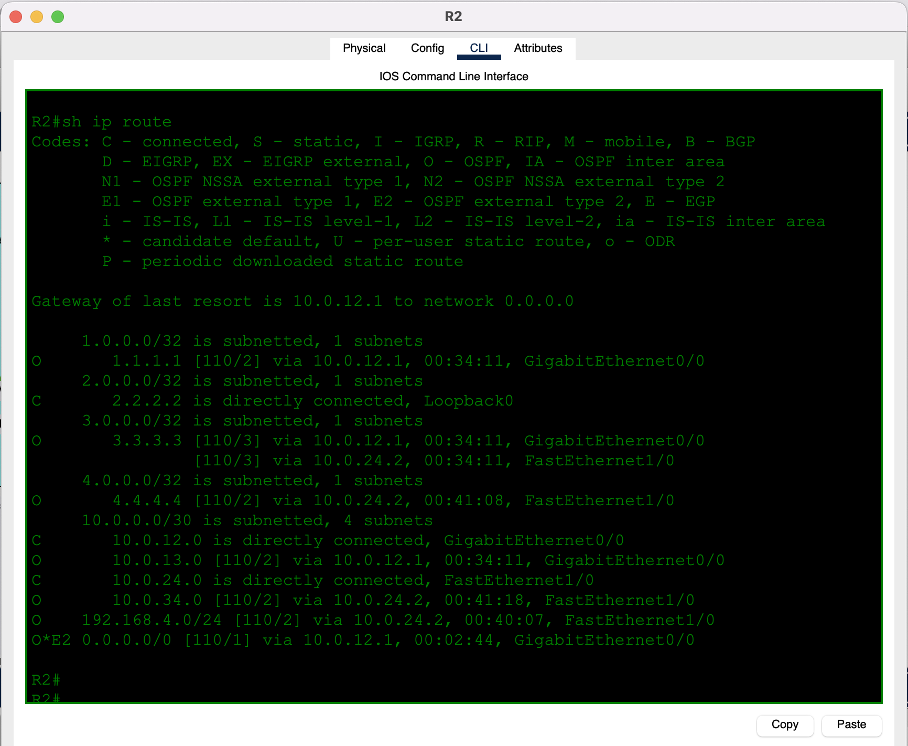

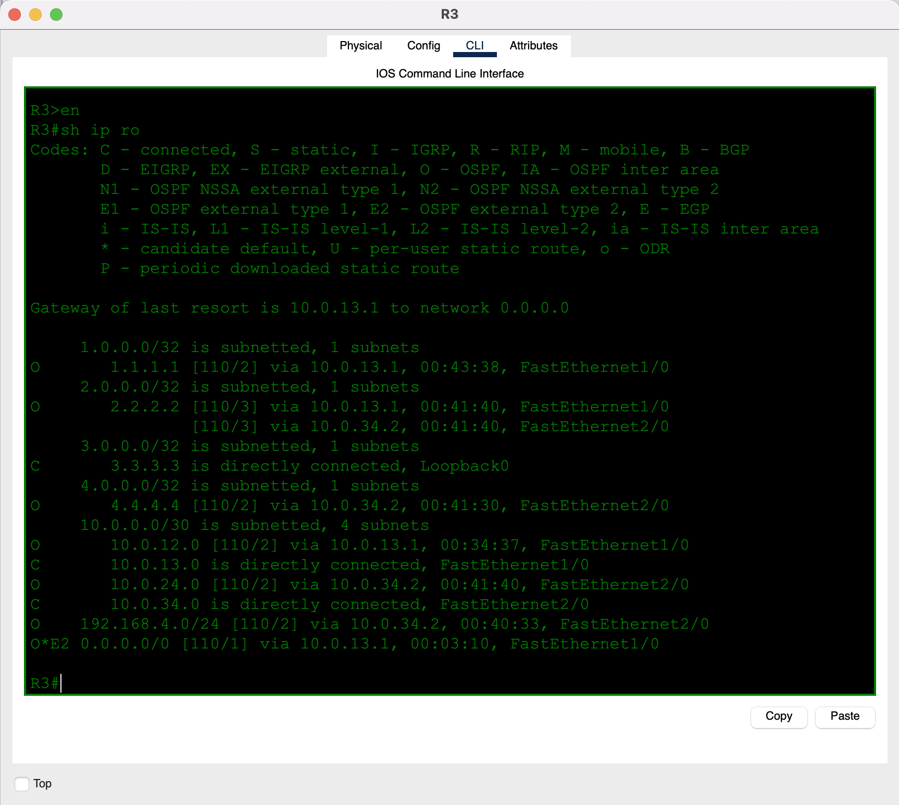

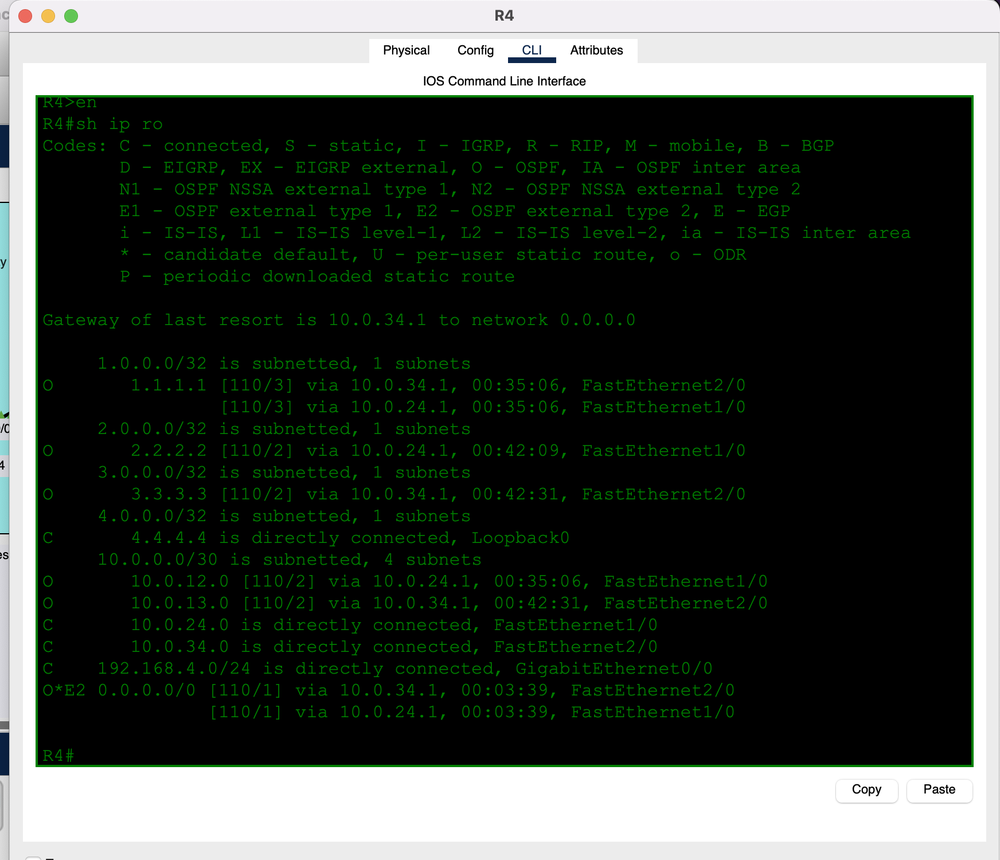

## ✅ Verification

| Check | Expected |
|-------|----------|
| `show ip ospf neighbor` | FULL on router–router links; none on Lo0 or R4 G0/0 |
| `show ip route` R2–R4 | `O` for far `/30`s, `/32` loopbacks, `192.168.4.0/24` |
| Default | `O*E2` on R2/R3/R4; R1 points at `203.0.113.2` |
| R1 G3/0 | `C 203.0.113.0/30` only — **not** an O network |
| PC1 ping `1.1.1.1` / Internet | works after OSPF + default |

## 💡 What I learned

Single-area OSPF replaces the mesh of statics: advertise each link (and loopback) into area 0, keep hellos off stub interfaces with **passive**. The Internet edge is **not** in OSPF; R1 injects a default instead (`default-information originate` → `O*E2`). Type-2 external metric does not increase hop-by-hop, which is why R4 shows **two** defaults at cost 1. You cannot put a `/30` network address on an interface (`10.0.13.0` failed; `.1` worked).

## 📎 Files in this lab

- `README.md` — this writeup
- `day26-ospf-part-1.pkt` — Packet Tracer save
- `day26-topology.png` — topology + tasks (main photo)
- `day26-r1-addrs.png` … `day26-r4-lan.png` — addressing
- `day26-r1-intbrief.png` … `day26-r4-intbrief.png` — loopbacks up
- `day26-r1-routes.png` … `day26-r4-routes.png` — OSPF tables + `O*E2`
